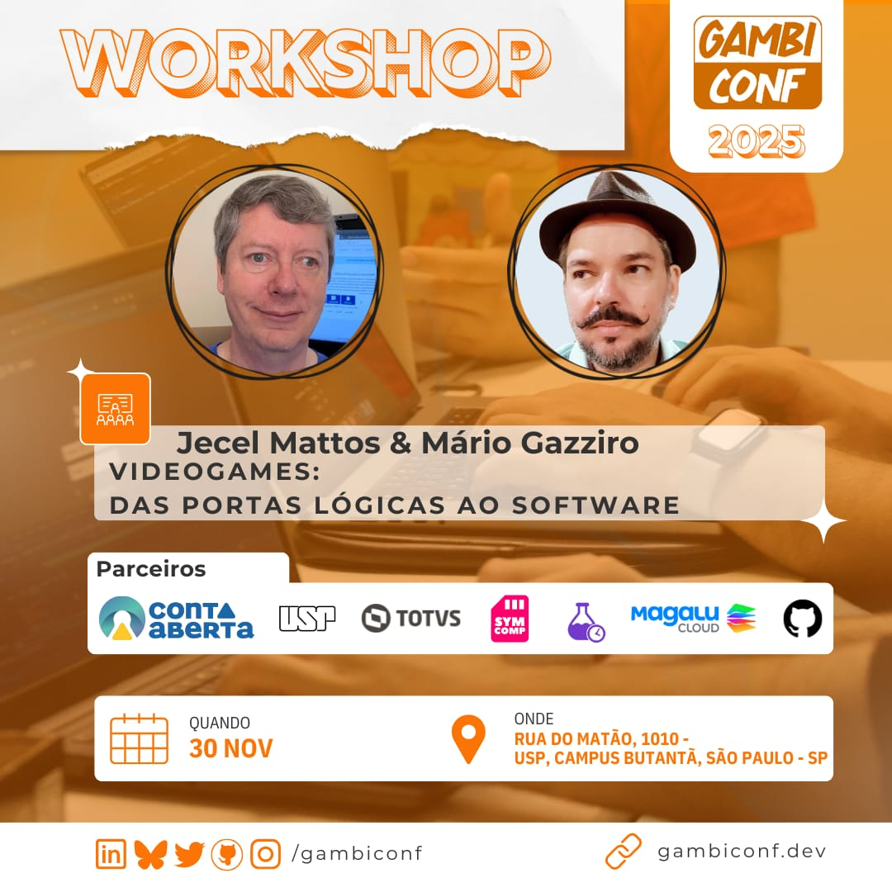

# Pegasus 42

- Texto em Português em [markdown](doc/pt-br/README.md) ou [PDF](doc/pt-br/Pegasus42.pdf)
- Text in English in [markdown](doc/en-us/README.md) or [PDF](doc/en-us/Pegasus42.pdf)

## Resumo em Português

O objetivo deste workshop da Gambiconf 2025 é mostrar como os elementos mais básicos do
computadores digitais e videogames funcionam e como podem ser usados para formar blocos
mais complexos até um computador completo.

Um simulador (chamado [Digital](https://github.com/hneemann/Digital)) será usado para
que os participantes do workshop possam experimentar todos os circuitos apresentados.

O computador final, o Pegasus 42 Jr, usa uma implementação simplificada de um processador (drv32h)
compatível com a versão de 32 bits da arquitetura padrão [RISC-V](https://riscv.org/)
e um circuito de vídeo de baixa resolução. Isso é suficiente para a programação de jogos
no estilo do início dos anos 1980.

## Summary in English

The goal for this Gambiconf 2025 workshop is to show how the most basic elements of
digital computers and videogame work and how they can be combined to create more
complex blocks up to a whole computer.

A simulator (called [Digital](https://github.com/hneemann/Digital)) will be used to allow
the workshop participants to experiment for themselves with all the presented circuits.

The final computer, Pegasus 42 Jr, uses a simplified implementation of a processor (drv32h) which is
compatible with the 32 bit version of the [RISC-V](https://riscv.org/) standard architecture
and a circuit for low resolution video. This is enough to program games in the style of the early 1980s.
