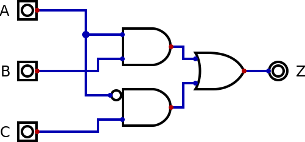
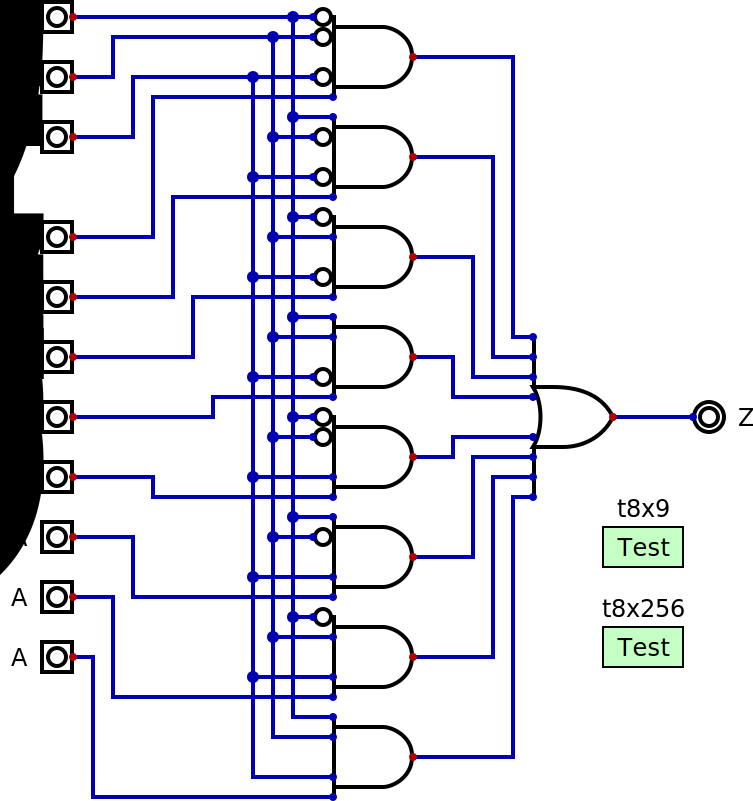
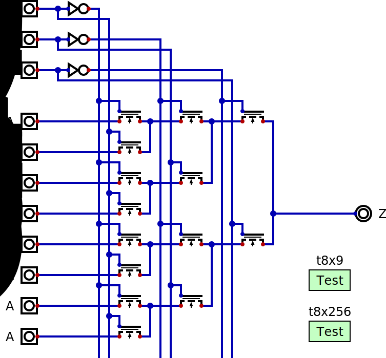

# 1. Switches, Logic Gates, Combinational Circuits

The goal of this workshop is to build a retro computer (roughly equivalent to what
people would have bought in the early 1990s for their home) called Pegasus 42 and
use it to program simple games. The idea is that the project can be completely
understood from the lowest level to the overall system.

For this we will initially use a simulator, and then move on to a FPGA (Field
Programmable Gate Array - a chip which can be reconfigured to implement any
digital circuit). For each level of abstraction there are several different
simulators we can use. From a high to low level we have:

| Level | Example Simulators |
|-------|--------------------|
| Architecture | QEMU, MAME |
| Micro-architecture | SPIM, SimpleScalar |
| Register Transfer | Verilator, ModelSim |
| Logic Gate | Digital, TkGate |
| Switches | IRSIM, MOSSIM |
| Analog Circuits | Spice, Xyce |
| Components | TCAD, DEVSIM |
| Physics | Elmer, Matlab |

The advantage of using a simulator instead of the real thing is being able to
see details that would be very hard, if not impossible, to measure in the
actual circuit. The low level simulators show far more details than the high
level ones, but are propotionally slower when running on the same computer.
So while it would be possible to simulate a whole computer using Spice, it might
take minutes for the simulated circuit to execute a single instruction. We
might have to wait for weeks to see if it correctly boots or not. Normally we
use the low level simulators for small subcircuits and then higher level
simuladors for the whole system.

When we said that the goal was to understand Pegasus 42 at the lowest level
we exagerated a bit. We will consider the switch level as being the lowest
one in this workshop. Even though *Digital* is not optimized for this level,
it is sufficient to illustrate the ideas that will be presented. It is also
not optimized for the higher levels, mas for the reduced projects that will
be studied it is sufficient (though too slow to show the operation of
circuits that output video in a usable manner).


An abstract representation of a system is a box with a number of inputs and
some outputs. Normally we will show the inputs coming from the left and the
outputs going right, but we can ignore this rule if it makes the drawing
more confusing.

## Digital ou Analog

The first choice we need to make is the nature of the inputs and outputs of
our system. For the analog inputs and outputs some quantity in our circuit
(voltage, current, etc) is analog to some quantity in the world (temperature,
brightness, etc). For the digital inputs and outputs several quantities in
the circuit represent a single value in the world. This set of quantities
can use separate inputs and outputs (a parallel representation) or a single
input ou output over time (a serial representation).

| characteristic | Analog | Digital |
|----------------|--------|---------|
| number of circuits | one | one per digit |
| precision | depends on circuit quality | always equal to the number of digits |
| noise     | accumulates at each operation | does not pass from input to output |

Analog circuits dominated computing until the middle of the 20th century, and
telecommunications until the end of the 20th century. The most important factor
was the number of circuits since the components were very expensive and their
connection was a manual process. With the evolution of integrated circuits the
cost became extremely low and the other factors lead to the digitalizations of
tecnology. Our project is digital.

Humanity has used several different digital systems to represent numbers, with
the most popular the positional decimal system wth hindu-arabic digits. The more
values each digit can have, the more sensitive to noise it becomes. But the fewer
values each digit can have, the more digits are necessary to represent the same
number. The best possible protection against noise is when each digit can have
only 2 values, like in the positional binary system.

Though the binary system needs more digits (and so, more circuits) than the alternatives,
each circuit is simpler so that is the option we shall use.

## Logic Gates

Combinational circuits are those whose output (or outputs) depends only on the
combination of the inputs. In the case of binary, each digit can only be either 0 or 1.
There are several areas of mathematics which are equivalent when only two values are
used.

| Área |   |   |   |   |   |
|------|---|---|---|---|---|
| Boolean Algebra | 1 | 0 | inversion | addition | product |
| Predicate Logic | true | false | not | or | and |
| Set Theory | universal set | empty set | complement | union | intersection |
| Switch Circuits | 5V | 0V | normally closed | parallel | series |

Notations from all of these areas can be used to represent combinational circuits. Yet
another possible representation is simply a table with a line for each combination of
input values and the corresponding output. We call this a "truth table" even with the
values shown are 0 and 1 instead of false and true.

We will not be completely consistent and might talk about a circuit being the in form
of "a sum of products" (Boolean Algebra) and another circuit of using "not and"
(Predicate Logic). The latter case is why the basic circuits are known as "logic gates".

To illustrate these ideas we will use [Digital](https://github.com/hneemann/Digital), the
simulator we had previously mentioned. *Digital* was written in Java, so it is necessary to
first insteall this language on your computer. The advantage of this is that *Digital* runs
on computers with different operating systems and different processors. The indicated site
is where the source code is, but that is only needed by those wanting to modify the
simulator. That page includes a "Download" button which will fetch *Digital.zip* with the
most recent version of the tool.

### Switches

Since we talked about circuits with switches, lets start there connecting two switches
in parallel between a lamp and a power supply. In the "File" menu we select "New". Using
the "Components" menu with "Switches" and "Switch" we can position two simple switches
anywhere we want. Then "Components", "IO", "LED" will give us a reasonable approximation
of the lamp we wanted (*Digital* has fancier options, but we won't use them here). Finally
in "Components", "Wires", "Supply voltage" gets us the power supply we need for our
circuito. Note that all circuits need both a power supply and a ground wire, but we
normally don't show those and the simulator works just the same. But if we want to
actually build the circuit we need to remember them.


If we imagine two gardens connected using two gates, with one beside the other (in
parallel), if one *or* the other is open we can go from one garden to the other. If
we simulate this circuit (menu "Simulation", "Start simulation" ou the button with
the simple triangle pointing right) we will see that the LED is off. But if we process
the switch on top *or* the switch on the bottom (or both) it turns on.


If we imagine two gardens connected using two gates, with one after the other with
a narrow path between them (in series), it is not enough for one of them to be open.
It will only be possible to pass from one garden to the other if the first gate *and*
the second gate are open. In this second circuit we connected the switches in series
and in the simulation we can see that the LED stays off unless the first *and* the
second switch have been pressed.

We have seen two of the three equivalencies between switches and areas of mathematics.
The table indicates the remaining equivalency (inversion, not, complement) as being
a normally close swtich. This kind of switch opens the circuit when pressed. But here
we will show an alternative that depends on the device level (the only time we will
go down to this level in this project).


We only need one switch here, and in place of the supply we use "Components", "Wires",
"Pull-Up Resistor". We also need "Components", "Wires", "Ground". When the switch is
open, a current goes through the resistor and into the LED, which shines. As the switch
is pressed it offers a path to 0V that draws the current from the resistor instead of
the LED, which turns off.


Here we have a more complex example using the same idea. Normally the AOI gate(and/or/invert)
is not considered to be a basic lógic gate and we will not see it again in this project,
but it is sufficiently useful that it is often included in a library for integrated circuit
design. In Boolean algebra we have:
```
Z = !(AxB + CxD)
```
while in predicate logic it would be:
```
Z = not((A and B) or (C and D))
```
A fourth representation of the AOI circuit (with the first being the figure, or schematic, the
second the boolean algebra and the third the logic equation) would be the truth table:

| A | B | C | D | Z |
|---|---|---|---|---|
| open | open | open | open | on |
| open | open | open | closed | on |
| open | open | closed | open | on |
| open | open | closed | closed | off |
| open | closed | open | open | on |
| open | closed | open | closed | on |
| open | closed | closed | open | on |
| open | closed | closed | closed | off |
| closed | open | open | open | on |
| closed | open | open | closed | on |
| closed | open | closed | open | on |
| closed | open | closed | closed | off |
| closed | closed | open | open | off |
| closed | closed | open | closed | off |
| closed | closed | closed | open | off |
| closed | closed | closed | closed | off |

The table shows a problem - the input have one nature (they are controled by a human finger)
while the output is of a different nature (light coming from the LED). If we want the outputs
of a circuit to be used as inputs of another circuits in order to build larger systems, they
need to be of the same kind. Fortunately switches which are controled using electricity have
been invented: relays (1835), vacuum tubes (1904) and transistors (1947). Even though *Digital*
can simulate relays in a limited way (like its switches) we will replace the switches in the AOI
circuit with MOSFET (Metal/Oxide/Silicon Field Effect Transistors) of the N type (negative)
which is used to make integrated circuits.


Besides replacing the switches with "Components","Switches","N-Channel FET" we also use
"Components","IO","Input" as well as "Output" from the same menu to show that these signals
can come from another circuit and that the result can go to another circuit. While simulating
we can change the values of the inputs and observe the value of the output.

In the "Analysis" menu, the "Analysis" item will create a truth table for the circuit and we
can verify that it is the same one as for the circuit with switches. A problem with this type
of circuit, which we call NMOS, is that whenever the output is 0 there is a current going
through the resistor and generating heat (and draining the battery if that is where the
power is coming from). Another kind of transistor, the "P-Channel FET", is the opposite
of the N type and conducts current when the input is 0. If we replace the resistor with
a complementary circuit of the N transistors using the P transistors (placing them in series
where the other is parallel) the circuit will work just the same but without a constant
current.


The extra complexity of CMOS relegated it to niche applications (like digital watches) in
the 1960s and 1970s, but it replaced nearly all other kinds of circuits in the 1980s when
the increasing number of transistors per chip (Moore's Law) made having twice as many
transistors worth it to reduce power.

### one input Logic Gates

So far we have seen a single logic gate with one input: Not.

With a single input, only two combination of inputs are possible: either 0 or 1. Its truth
table will be two lines in size. The output in each line can have two values, so there
are 2^2 = 4 possible truth tables.

| A | Z |
|---|---|
| 0 | 0 |
| 1 | 0 |

In the first gate the output is always 0. It isn't surprising that we didn't talk about it.
In circuit terms we only need to connect the output to the ground wire.

| A | Z |
|---|---|
| 0 | 1 |
| 1 | 0 |

This is the Not gate that we have already seen.

| A | Z |
|---|---|
| 0 | 0 |
| 1 | 1 |

Here the output is the same as the input. Just like in the first circuit we can implement this
with just a wire.

| A | Z |
|---|---|
| 0 | 1 |
| 1 | 1 |

The final gate is an output that is always one. This can also be done with a wire connected to
the power supply.

So out of the 4 possible gates, only Not is interesting. Note that if we consider the value of
Z in each table as the bits of a binary number with the first line being the least significant
digit, we can call these gates "gate 0" (Z = 0), "gate 1" (Z = !A), "gate 2" (Z = A) and "gate 3"
(Z = 1).

### two input Logic Gates

Using the same thinking, a two input gate has 4 possible input combinations and therefore a
truth table with 4 lines. Using the same scheme to number them we will have a 4 bit binary
number indicating that there are 2^4 = 15 possible logic gates.

| outputs | equation | name |
|--------|---------|------|
| 0 0 0 0 | Z = 0 |     |
| 0 0 0 1 | Z = !(A+B) | NOR |
| 0 0 1 0 | Z = Ax!B  |     |
| 0 0 1 1 | Z = !B |      |
| 0 1 0 0 | Z = !AxB |    |
| 0 1 0 1 | Z = !A |    |
| 0 1 1 0 | Z = (!AxB)+(Ax!B) | XOR |
| 0 1 1 1 | Z = !(AxB) | NAND |
| 1 0 0 0 | Z = AxB | AND |
| 1 0 0 1 | Z = (AxB)+(!Ax!B) | XNOR |
| 1 0 1 0 | Z = A |  |
| 1 0 1 1 | Z = A+!B |   |
| 1 1 0 0 | Z = B |  |
| 1 1 0 1 | Z = !A+B |   |
| 1 1 1 0 | Z = A+B | OR |
| 1 1 1 1 | Z = 1 |    |

Gates 0000 and 1111 don't actually have any inputs, while 0011, 0101, 1010 and 1100 ignore one
of the inputs. They are actually they gates we already saw above.

6 gates have names in the menu "Componentes", "Logic" as well as a corresponding drawing. There
is a special shape for AND (1000), OR (1110) and XOR (exclusive OR - 0110) and for their inverses
we just add a little circle to the output and an "N" to the begining of the name. *Digital* also allows
a little circle to be added to any of the inputs which means we can use an AND for gates 0010 and 0100
and an OR for 1011 and 1101.

#### Sum of Products

If we look at the line for XOR and XNOR we will notice that they are the most complicated ones. In
the case of XOR the first product (AND) is !AxB which corresponds directly to the left 1, while
Ax!B is what generated the right 1.

| outputs | product |
|--------|---------|
| 0 0 0 1 | !Ax!B  |
| 0 0 1 0 | Ax!B   |
| 0 1 0 0 | !AxB   |
| 1 0 0 0 | AxB    |

So the XOR is the sum (OR) of the second and third prodcuts of this table. This is actually true for
any logic gate and can be expanded for any number of inputs. This means that nobody will ever discover
as new logic gate in the future that we don't know how to implement. The truth table can be transformed
directly into a circuit.

That doesn't mean that the circuit created this way will be very good. Using this method for the next
to the last logic gate we would have
```
Z = (Ax!B)+(!AxB)+(AxB)
```
But we know that a simple OR gate will do the same thing. Fortunately Boolean algebra has rules
for simplification much like the rules in normal algebra, and there is a graphical method (called
Karnough Map, which is one of the things *Digital* can generate) to reduce the logic to the minimum
while keeping the same operation.

## Multiple Bits

One disadvantage of digital circuits relative to analog ones is the repetition of the same circuit
for each digit. If we use 32 bits to represent values, we will have 32 copies of each circuit.


*Digital* has a feature which can reduce this complexity. For each input and output, besides the name
we can define a "width" in number of bits. In the above circuit we changed *A*, *B*, *X* and *Y* to have
4 bits each. In "Components","Wires","Splitter/Merger" we have a way to connect signals with different
numbers of bits. In the two on the left the input was configured as "4" and the output as "1,1,1,1" while
the one on the right was configured as the opposite. In addition, each normal component can be configured
to have a given width. The exclusive or gate at the top was configured to 4 bits while the four below it
as 1 bit each.

Both circuits should be completely equivalent, but the one on top is easier to understand since it is
much smaller. And this is for only 4 bits - the gain for, for example, 32 bits is proportionally greater.
While editing the circuit, *Digital* does not give any visual indications that the top gate is different
than the others, that the inputs and outputs are for multiple bits nor even that the wires connecting them
will be carrying multiple bits. During simulation, however, the wires with 1 bit are shown in dark green
(for 0) or light green (for 1) while those with several bits continue dark blue with the current value
shown right above the wire. And clicking on a 1 bit input will invert its value while on a multiple bit
input this will open a dialog box to define the new value.

Using "Analysis","Analysis" we can see the truth table and compare the bits fomr *X* and *Y* to check
that the circuits are actually equivalent. With 256 lines, however, this confirmation is quite tiring.
And if we make any changes to the circuit we will have to repeat this careful examination of the truth
table. Fortunately, *Digital* allows us to automate this using "Components","Misc","Test Case". We edit
the test (which we name "eqv") to:
```
A B X Y

loop(a,16)
  loop(b,16)
        (a)  (b)  (a^b)  (a^b)
  end loop
end loop
```
Using "Simulation","Run tests", all 256 combinations of *a* and *b* are generated for *A* and *B*
and *X* and *Y* are compared with *a XOR b*. All tests that pass are shown in green and all tests
that fail are shown with a red "x". It is possible to examine the details to know where a failure
happened.

Another way that *Digital* hides complexity is the use of hierarchical projects. Several components
can be combined into a circuit that is then shown as a single block in a higher level circuit.
Any practical project should make extensive use of this as well as include many tests for each
sub-circuit. But since the goal of this workshop is to show the complexity of a computer, the
projects that will be shown will be as "flat" as possible. Sub-ciruits are often compared with
subroutine calls in programming languages but they are actually more like macros.

## Decisions

In programming languages we have constructions like "if A then B else C" to use one input to select
between two other inputs.



Looking at the truth table we can see that Z = B whenever A é 1, but Z = C when A is 0. This means
that combinational circuits can make decisions. It is possible to select between more than two
alternatives, like in the "switch/case" statements that programming languages have.



This is more complicated to test because with 8+3 = 11 inputs there are 2048 possible combinations.
The complete test (t8x256) is possible:
```
S_2 S_1 S_0   A_7 A_6 A_5 A_4 A_3 A_2 A_1 A_0  Z

loop(s,8)
  loop(a,256)
        bits(3,s) bits(8,a) bits(1,a>>s)
  end loop
end loop
```
Here we are confirming that the output corresponds to the bit selected by *S* (*Z* is calculated by
right shifting so that the least significant bit is the one from the desired input). A more careful
test would be to check that when all inputs are 0 the output is also 0 and then to turn on each
input, one at a time. The output should remain at 0 except when it is the selected input that goes
to 1. Instead of 8x256 tests we need only 8x9. In this case the more complete test is actually better,
but during the fabrication of some product where part of the cost is the time spent using test
equipment the reduced solution would be more interesting.

Our project will use many multiplexers and the circuit above is rather big (and would have to be
repeated 32 times to select between 8 values of 32 bits each). At the logic gate level this is
the best solution, but if we go down to the switch level we can save transistors.



This circuit passes the same tests as the previous one. In practice this use of NMOS pass transistors
reduces the signal level, but adding two inverters to the output will eliminate this problem. Using
pairs of NMOS and PMOS pass transistors is another solution, but the wiring becomes a bit more complex.
The idea of showing this was so we can use multiplexers in our projects without worrying too much about
their cost.

---

- [2. Sequential Circuits](2.seq.md)
- [3. Processors](3.cpu.md)
- [4. FPGAs and Shin JAMMA](4.fpga.md)
- [5. Video and Audio](5.av.md)
- [6. Pegasus 42](6.pegasus42.md)
- [A. History](A.hist.md)
