- [1. Switches, Logic Gates, Combinational Circuits](1.comb.md)

---

# 2. Sequential Circuits

Time is not a factor for a combinational circuito. Of course, given that it is not infinitely fast the
answer will only be ready after a certain delay after the inputs receive their values.

In contrast, time is fundamental for sequential circuits. The inputs arrive as a sequence over time using
the same signals and the results are also sent as a sequence of values over time. We can convert the
abstract combinational circuit we previous saw into a sequential system by connecting some of its outputs
to inputs. We call the value being fed back the "current state" of the system.

In practice a circuit like this can even work, but it would be rather unstable since some paths generating
some of the bits of the current state might have longer delays than those for other bits. The most popular
solution is to add a "clock" signal so the feedback can happen in a more controlled fashion.

## Oscillators

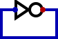

*Digital* refuses to simulate this circuito, which is the simplest sequential system. One problem is that
the circuit is contradictory: the output would have to be 1 for a 0 input, or 0 for a 1 input. But there
is a wire connecting them so they should have the same value. If we actually build this circuit it will
keep quickly alternating between 0 and 1. This is what we call an "oscillator". The oscillation frequency
depends on the speed of the inverter and the delay of the wire. The main problem from a simulation viewpoint
is that the initial value is unknown, which we can solve with an initialization signal (we will call it "reset").

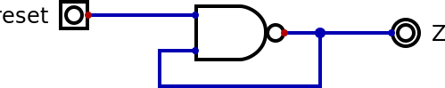

If we try to simulate this circuit it seems to work, but as soon as we change *reset* to 1 an error occurs. The
solution is to simulate step by step. After changing *reset* to 1, at each step in the simulation the output
alternates between 0 and 1.

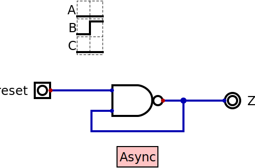

Adding "Components","Misc","Async" changes how the simulation's visualization happens, and with "Componentes","IO",
"Graph" we can visualize the input and outputs over time, which is to sequential circuits what truth tables is to
combinational circuits.

## Memory

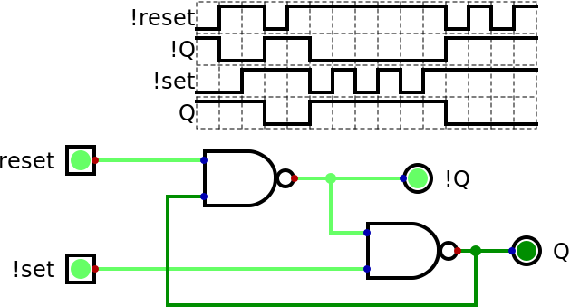

Connecting two such oscillators in series makes it stop oscillating since an even number of inversions is not
contradictory. This circuito is "bi-stable", meaning there are two different situations in which the circuit
stays put. The output of the first part is always the opposite of the output of the second part, so we use a "!"
in front of its name. We also do that for the inputs to indicate that these should normally stay at 1 and should
only go to 0 when we want it to do its job.

The name of this circuito is "flip-flop" to indicate its bi-stable nature, and it is a computer's simplest memmory
capable of holding 1 bit. A more complete name is "RS flip-flop" since the inputs *!reset" and *!set* are separate.
The circuit "remembers" that a negative pulse has arrived at *!set* even after that pulse is no longer there.
Additional pulses don't do anything. The same thing for pulses at *!reset*.

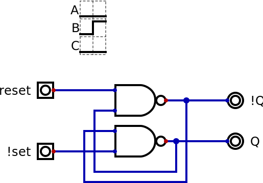

This is exactly the same circuit, but drawn in the style of the abstract sequential system with the outputs going
all the way around the circuito to connect to the inputs. The idea is that even with the complications of the
next circuits we can still keep in mind that this feedback is happening.

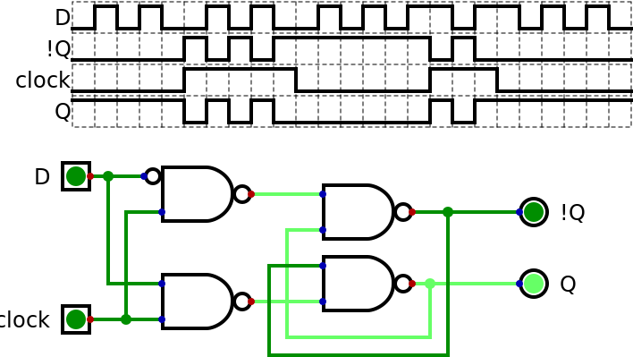

Instead of directly generating *!reset* and *!set* it is more convenient to have a data signal *D* and a *clock*
signal. When the clock is high, the output reflects *D* with a small delay. When the clock is low the output
value doesn't change no matter what is happening in *D*.

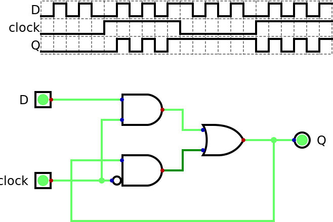

We can also use a multiplexer to have the same functionality. Though in this case we don't have the inverted input.
Modern project avoid using latches because during half of the clock cycle we can't trust the output. Using two
latches in a row operating on oppostive levels of the clock we can have an output that remains stable during
nearly the whole cycle, with the only uncertainty very close to one of the clock edges.

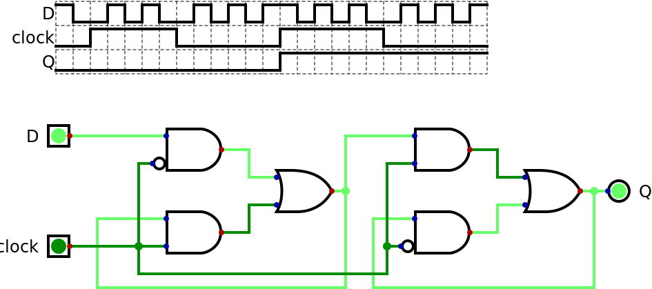

We can have this same funcionality by selecting "Components","Memory","Register". But it is important to understand
what is happening inside the component. We also replaced the *clock* input from a regular one to a special input.
In this simulation it didn't make any difference, but we can configure it to pulse at a give rate without having
to keep manually clicking on it. And in the tests this kind of input can be set to not only 0 and 1 but also C to
indicate a rising edge.

## Finite State Machines

Using registers we can solve the stability problem mentioned for the abstract sequential circuit. We just have
to pass the output signals to be fed back through registers and make the register outputs be the ones to actually
go back into the inputs. This way it doesn't matter if different bits have different delays since all of them will
be sampled at the same time on the rising edge of the clock. The only remaining worry related to time is to check
that these edges are sufficiently far apart that the combinational circuit has time to finish its job. This is
why we say that one processor can run at 1.5 GHz while another can go up to 3.2 GHz.

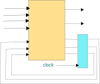

With the introduction of a lock, the state of the system can be thought of as jumping instantly from one value to
the next. The number of possible states is limited by the number of bits used to represent the current state, but
the number of actual states can be much smaller than that. We call this kind of system "Finite State Machine" (FSM).

One possible representation for FSMs is a table with, for example, one line for each state and one column for each
possible input. Each cell would indicate the output as well as the next state. *Digital* has an editor for a very
popular graphical representation: each state is shown as a circle and arrows connecting the circles show the
possible transitions. The arrows indicate what values the inputs must have to jump to the other state as well as
what the values of the outputs should be.

Among the examples supplied with *Digital* we have *rotDecoderMealy.fsm* with *A* and *B* as inputs and *L* and
*R* as ouputs. Each state has a name, but it also has a number from 0 to 6 which are the values that the
registers should have for each state. This system can detect if an axis is rotating to the left or to the right.

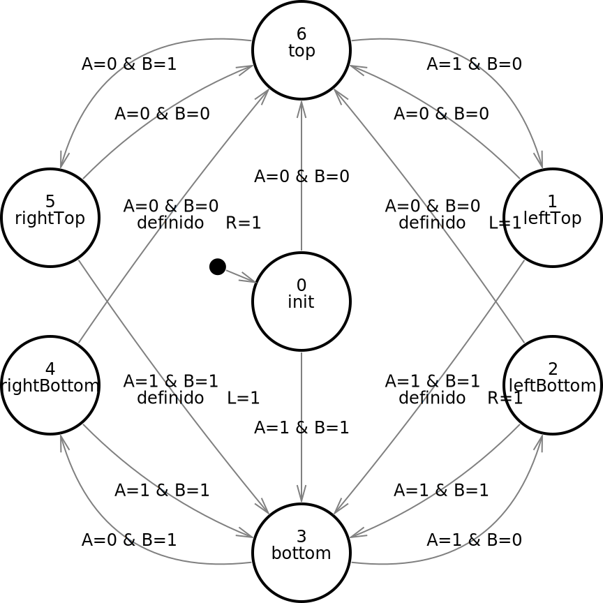

The "Mealy" in the file name is to indicate that this a Mealy type FSM, which was defined by George H. Mealy in 1955.
One feature of this kind of FSM is that the outputs depend not only on the current state but also on the other
inputs. This means that the outputs might change between clock edges if the inputs change.

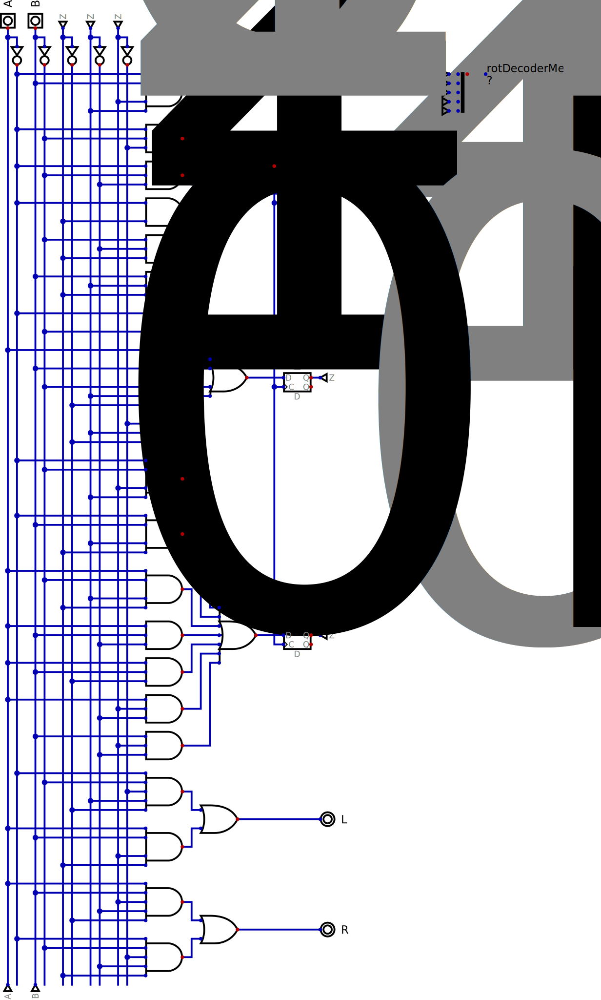

In the FSM editor we have the option of generating the truth table (for the "transitions", since as a sequential system
the machine as a whole can't be decribed by a truth table) and from the table we can ask for a circuit to
be created. The current state is stored in registers 2n, 1n and 0n and we can see the *A* and *B* inputs we well as
the combinational circuit in the form of sum of prodcuts that generated both the value of the next state and the outputs
*L* and *R*.

The outputs of the registers should have wires going to the inputs of the combinational circuit. *Digital* has a
feature called *tunnel* which allows a signal to jump from one place to another (or several others) without
crossing over the rest of the drawing, and that was used here.

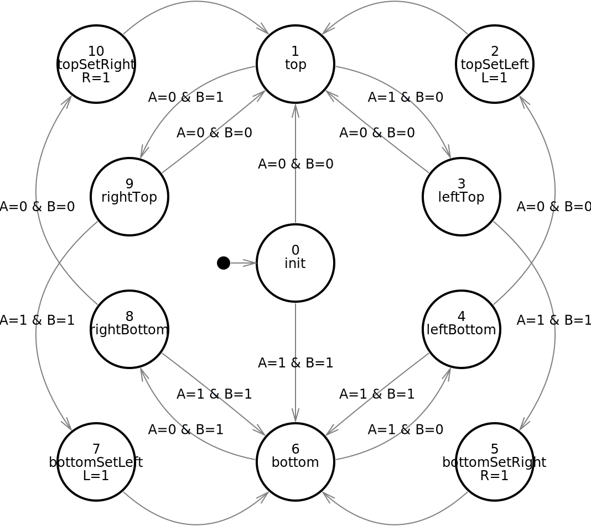

In 1956 Edward F. Moore defined another variation of the FSM where the outputs depend exclusively on the current
state. The advantage is that the outputs remain stable between clock edges. In the same example implemented as a Moore
type FSM we see that extra states are needed for the same result, in this case.

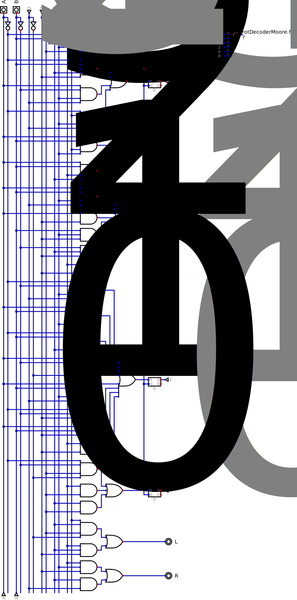

The most obvious difference between this circuit and the previous one is that outputs *L* and *R* don't have
any connections with inputs *A* and *B*.

---

- [3. Processors](3.cpu.md)
- [4. FPGAs and Shin JAMMA](4.fpga.md)
- [5. Video and Audio](5.av.md)
- [6. Pegasus 42](6.pegasus42.md)
- [A. History](A.hist.md)
