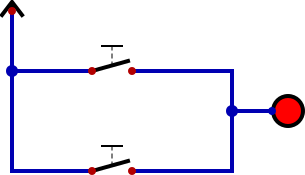
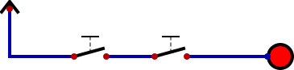
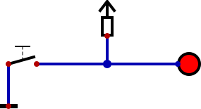
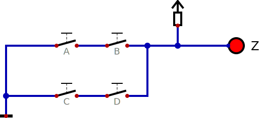
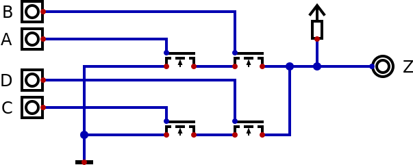
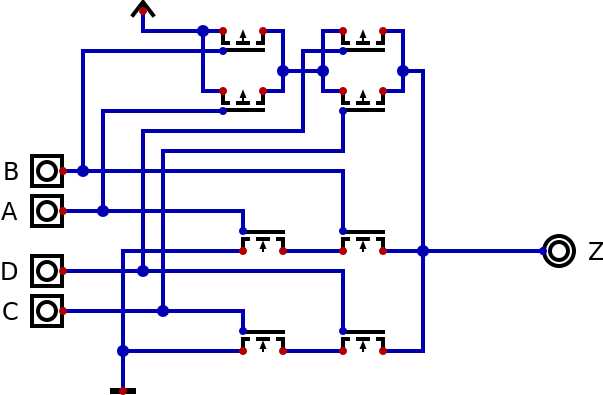

# 1. Chaves, Portas Lógicas, Circuitos Combinacionais

O objetivo deste workshop é a construção de um retro computador (mais ou menos equivalente
ao que as pessoas comprariam para ter em casa no início dos anos 1990) chamado Pegasus 42
e usá-lo para programar uns jogos simples. A idéia é que o projeto possa ser completamente
entendido desde o nível mais baixo até o sistema em geral.

Para isso usaremos inicialmente um simulador, e depois passaremos as usar uma FPGA (
Field Programmable Gate Array - um chip que pode ser reconfigurado para implementar
qualquer circuito digital). Para cada nível de abstração existem vários simuladores
que podemos usar. De um alto nível para baixo nível temos:

| Nível | Exemplo de Simuladores |
|-------|--------------------|
| Arquitetura | QEMU, MAME |
| Micro-arquitetura | SPIM, SimpleScalar |
| Transferência de Registradores | Verilator, ModelSim |
| Portas Lógicas | Digital, TkGate |
| Chaves | IRSIM, MOSSIM |
| Circuitos Analógicos | Spice, Xyce |
| Componentes | TCAD, DEVSIM |
| Física | Elmer, Matlab |

A vantagem de se usar um simulador ao invés do produto de verdade é poder ver
detalhes que seriam muito difíceis, senão impossível, de medir no circuito
real. Os simuladores de baixo nível mostram muito mais detalhes que os de alto
nível, mas são proporcionalmente mais lentos quando executados num mesmo computador.
Por isso apesar de ser possível simulador um computador completo usando o Spice,
talvez level minutos para o circuito simulado executar uma única instrução. Podemos
ter que esperar semanas para saber se ele carrega o sistema operacional ou não.
Normalmente usamos os simuladores de baixo nível para pequenos trechos do projeto
e simuladores de mais alto nível para o sistema completo.

Quando dissemos que o objetivo era entender o Pegasus 42 ao nível mais baixo
exageramos um pouco. Vamos considerar o nível de chaves como sendo o mais baixo
neste workshop. Apesar do Digital não ser otimizado para este nível, ele é suficiente
para ilustrar as idéias que serão apresentas em seguida. Ele também não é otimizado
para os níveis mais altos, mas para os projetos reduzidos que serão estudados ele
é suficiente (mas é lento demais para mostrar a operação de circuitos que geram
vídeo de maneira usável).


Uma representação abstrata de um sistema é um retêngulo com um número de entradas
e algumas saídas. Normalmente mostraremos as entradas vindo da esquerda e as saídas
indo para a direita, mas podemos ignorar esta regra se estiver deixando o desenho
mais confuso.

## Digital ou Analógica

A primeira escolha que precisamos fazer é a natureza das entradas e saídas do nosso
sistema. Nas entradas e saídas analógicas algum valor do nosso circuito (tensão, corrente, etc) é
análogo a algum valor do mundo (temperatura, brilho, etc). Nas entradas e saídas digitais
uma série de valores do circuito representam um único valor do mundo. Esta série pode
usar entradas ou saídas separadas (representação paralela) ou uma mesma entrada ou saída
ao longo do tempo (representação serial).

| característica | Analógico | Digital |
|----------------|-----------|---------|
| número de circuitos | um | um por dígito |
| precisão | depende da qualidade do circuito  | sempre igual ao número de digitos |
| ruído    | acumula a cada operação    | não passa da entrada para saída |

Os circuitos analógicos dominaram a computação até a metade do século 20, e a telecomunicação
até o fim do século 20. O fator mais importante era o número de circuitos já que os componentes
eram muito caros e a ligação deles um processo manual. Com a evolução dos circuitos integrados
o custo passou a ser muito baixo e os outros fatores levaram à digitalização da tecnologia.
Nosso projeto é digital.

A humanidade tem usado vários sistemas digitais diferentes para representar números, sendo
o mais popular o sistema posicional decimal com digitos indu-arábicos. Quanto mais valores
cada dígito pode ter, mas sensível fica aos ruídos. Mas quanto menos valores cada digito poder
ter, mais dígitos são necessários para representar o mesmo número. A melhor proteção possível
contra o ruído é quando cada dígito pode ter apenas 2 valores, como no sistema posicional binário.

Apesar do sistema binário precisar de mais dígitos (e, portanto, mais circuitos) que as alternativas,
cada circuito é mais simples de modo que é a opção que usaremos.

## Portas Lógicas

Os circuitos combinacionais são aqueles cuja saída (ou saídas) depende apenas da combinação das
entradas. No caso binário, cada digíto só pode ser ou 0 ou 1. Existem várias áreas da matemática
que são equivalentes quando são usados apenas dois valores.

| Área |   |   |   |   |   |
|------|---|---|---|---|---|
| Álgebra Booleana | 1 | 0 | inversão | soma | produto |
| Lógica de Predicados | verdade | falso | não | ou | e |
| Teoria dos Conjuntos | conjunto universal | conjunto vazio | complemento | união | intersecção |
| Circuitos de Chaves | 5V | 0V | normalmente fechado | paralelo | série |

Notações de todas estas áreas podem ser usadas para representar os circuitos combinacionais. Uma
outra representação possível é simplesmente uma tabela com uma linha para cada combinação de
entradas e indicando a saída correspondente. Chamamos isso de "tabela verdade" mesmo quando os
valores mostrados são 0 e 1 ao invés de falso e verdadeiro.

Não seremos completamente consistentes, podendo descrever um circuito como tendo a forma de
"soma de produtos" (Álgebra Booleana) e outro circuito como contendo "não e" (Lógica de Predicados).
Este último é a razão dos circuitos básicos serem conhecidos como "portas lógicas".

Para ilustrar estas idéias usaremos o simulador [Digital](https://github.com/hneemann/Digital),
como mencionamos anteriormente. O Digital foi escrito em Java e por isso é necessário instalar
esta linguagem no seu computador antes de poder usá-lo. A vantagem disso é que roda em computadores
com diferentes sistemas operacionais e diferentes processadores. O site indicado é o do código
fonte, mas isso só necessário para quem quer modificar o simulador. Na página tem um botão "Download"
para baixar *Digital.zip* com a versão mais recente da ferramenta.

### Chaves

Como falamos de circuitos de chaves, vamos começar por ai ligando duas chaves em paralelo entre
uma lâmpada e uma fonte de alimentação. No menu "Arquivo" selecionamos "Novo". Usando o menu
"Componentes", "Chaves", "Chave" posicionamos duas chaves simples como desejamos. Já em "Componentes",
"Entradas e Saídas", "LED" temos uma aproximação razoável para a lâmpada que desejamos (o Digital
tem opções mais sofisticadas mas não as usaremos aqui). Finalmente em "Componentes", "Conexões",
"Fonte" temos uma alimentação para o circuito. Note que todos os circuitos precisam de alimentação
e de um sinal terra, mas normalmente não mostramos estes e o simulador funciona assim mesmo. Mas
se formos construir o circuito de verdade precisamos nos lembrar deles.



Se imaginarmos duas salas com duas portas entre elas, uma ao lado da outra (em paralelo), se uma
*ou* outra estiver aberta poderemos ir de uma sala para a outra. Se simularmos este circuito
(menu "Simulação", "Iniciar a simulação" ou então o botão com triângulo simples apontando para
a direita) veremos que o LED fica apagado. Mas se acionarmos a chave de cima ou a chave de baixo
(ou as duas) ele acende.



Se imaginarmos duas salas com duas portas entre elas, uma depois da outra via um pequeno corredor
(em série), não basta que uma porta esteja aberta. Só será possível passar de uma sala para outra
se a primeira *e* e segunda porta estiverem abertas. Neste segundo circuito ligamos as chaves em
série e na simulação vemos que o LED permanece apagando a não ser que a primeira *e* a segunda
chave tenham sido pressionadas.

Vimos duas das tres equivalências entre chaves e áreas da matemática. A tabela indica a última
equivalência (inversão, não, complemento) como sendo uma chave normalmente fechada. Este tipo
de chave abre o circuito quando pressionada. Mas aqui iremos mostrar uma alternativa de depende
do nível de dispositivos (o único caso que em baixaremos até este nível neste projeto.)



Só usamos uma chave aqui e no lugar da alimentação usamos "Componentes", "Conexões", "Resistor
Pull-Up". Também precisamos de "Componentes", "Conexões", "Terra". Com a chave aberta uma corrente
passa pelo resistor e pelo LED, que fica aceso. Ao ser pressionada a chave oferece um caminho
para 0V e a corrente vinda do resistor passa por ela ao invés do LED, que se apaga.



Aqui temos um exemplo mais complexo usando a mesma idéia. Geralmente a porta AOI ("and/or/invert" - e/ou/inverte)
não é considerada porta básica e não a veremos mais neste projeto, mas ela é útil o suficiente
para ser incluida em muitas bibliotecas de projeto de circuito integrado. Em álgebra Booleana temos:
```
Z = ~(AxB + CxD)
```
enquanto na lógica de predicados seria:
```
Z = não((A e B) ou (C e D))
```
Uma quarta representação do AOI (sendo a primeira a figura ou esquemático, a segunda a álgebra Booleana
e a terceira a equação lógica) seria a tabela verdade:

| A | B | C | D | Z |
|---|---|---|---|---|
| aberta | aberta | aberta | aberta | acesa |
| aberta | aberta | aberta | fechada | acesa |
| aberta | aberta | fechada | aberta | acesa |
| aberta | aberta | fechada | fechada | apagada |
| aberta | fechada | aberta | aberta | acesa |
| aberta | fechada | aberta | fechada | acesa |
| aberta | fechada | fechada | aberta | acesa |
| aberta | fechada | fechada | fechada | apagada |
| fechada | aberta | aberta | aberta | acesa |
| fechada | aberta | aberta | fechada | acesa |
| fechada | aberta | fechada | aberta | acesa |
| fechada | aberta | fechada | fechada | apagada |
| fechada | fechada | aberta | aberta | apagada |
| fechada | fechada | aberta | fechada | apagada |
| fechada | fechada | fechada | aberta | apagada |
| fechada | fechada | fechada | fechada | apagada |

A tabela mostra um problema - as entradas tem uma natureza (são acionadas por um dedo humano) e a
saída tem uma natureza bem diferente (luz saíndo do LED). Se queremos que as saídas de um circuito
possam ser usadas como entradas de um outro circuito para construir sistemas maiores elas precisam
ser do mesmo tipo. Felizmente foram inventadas chaves que são acionadas por eletricidade:
relés (1835), válvulas termiônicas (1904) e transistores (1947). Apesar do Digital poder simular
relés de modo limitado (como as chaves), vamos trocar as chaves do circuito AOI por transistores
MOSFET (Metal/Oxide/Silicon Field Effect Transistor) tipo N (negativo) que é usado em circuitos
integrados.



Além de trocarmos as chaves por "Componentes","Chaves","FET tipo N" também usamos "Componentes",
"Entradas e Saídas", "Entrada" e também "Saída" do mesmo menu para indicar que estes sinais podem
vir de outro circuito e os resultados podem ir para outro circuito. Na simulação podemos trocar
os valores das entradas e observar os valores da saida.

No menu "Análises", o itém "Analises" cria uma tabela verdade para o circuito e podemos verificar
que é a mesma do circuito com chaves. Um problema deste tipo de circuito, que chamamos de NMOS,
é que sempre que a saída é 0 existe uma corrente passando pelo resistor e gerando calor (e drenando
a bateria se esta for de onde vem a alimentação). Um outro tipo de transistor, o "FET tipo P",
é o oposto do tipo N e conduz corrente quando a entrada é 0. Se trocarmos o resistor por um
circuito complementar ao dos transistores N usando transistores P (em série quando o outro é
paralelo) o funcionamento do circuito continuará o mesmo mas sem que corrente fique passando
sempre.



A complexidade adicional do CMOS limtou este tecnologia a nichos (como relógios digitais) nos
anos 1960 e 1970, mas praticamente substituiu todos os outros tipos de circuitos nos anos 1980
quando o crescente número de transistores por chip (Lei de Moore) tornou gastar o dobro de
transistores uma boa solução para reduzir a potência.

---

- [2. Circuitos Sequenciais](2.seq.md)
- [3. Processadores](3.cpu.md)
- [4. FPGAs e Shin JAMMA](4.fpga.md)
- [5. Vídeo e Áudio](5.av.md)
- [6. Pegasus 42](6.pegasus42.md)
- [A. História](A.hist.md)
