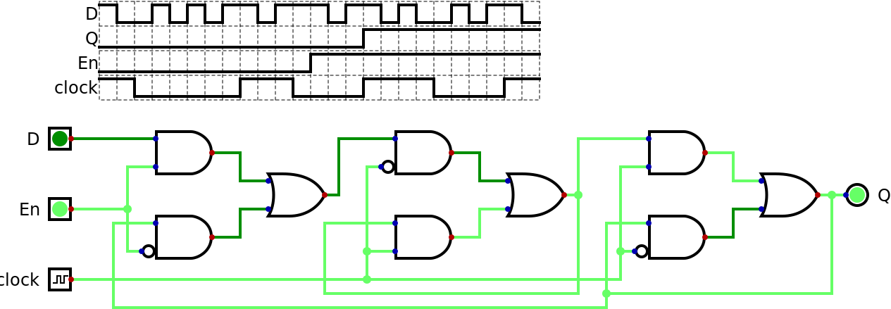

- [1. Chaves, Portas Lógicas, Circuitos Combinacionais](1.comb.md)

---

# 2. Circuitos Sequenciais

O tempo não é um fator num circuito combinacional. É verdade que não sendo infinitamente rápido, a resposta
só fica pronta depois de um certo atraso depois que as entradas recebem seus valores.

Já nos circuitos sequenciais o tempo é fundamental. As entradas chegam em sequência pelos mesmos sinais ao
longo do tempo e as respostas também são enviadas como uma sequência de valores ao longo do tempo. Podemos
converter o sistema combinacional abstrato que já vimos num sistema sequencial ligando algumas das suas saídas
nas entradas. Dizemos que o valor sendo realimentado é o "estado atual" do sistema.

Na prática um circuito destes pode até funcionar, mas seria um tanto instável pois alguns caminhos gerando uns
bits do estado atual podem ter atrasos maiores que os de outros bits. A solução mais popular é acrescentar um
sinal de "relógio" para que a realimentação ocorra de modo controlada.

## Osciladores

O *Digital* se recusa a simular este circuito, que é o sistema sequencial mais simples. Um problema é que o circuito
é contraditório: a saída teria que ser 1 para entrada 0, ou 0 para entrada 1. Mas tem um fio ligando as duas de
modo que elas tem o mesmo valor. Se construirmos este circuito ele vai ficar alternando muito rapidamente entre
0 e 1. É o que chamamos de "oscilador". A frequência da oscilação depende da velocidade do inversor e o atraso no
fio. O problema principal do ponto de vista do simulador é que o valor inicial é desconhecido, o que pode ser
resolvido com um sinal de inicialização (em inglês é "reset").

Se tentarmos simular parece funcionar, mas assim que mudamos *reset* para 1 aparece um erro. A solução é a simulação
passo a passo. Depois de mudar *reset* para 1 a cada passo da simulação a saída alterna entre 0 e 1.

Acrescentando "Componentes","Diversos","Async" muda um pouco como a visualização da simulação ocorre, e com
"Componentes","Entradas e Saídas","Gráfico de dados" podemos ter uma visualização das entradas e saídas ao longo do
tempo, que é para circuitos sequenciais o que a tabela verdade é para circuitos combinacionais.

## Memória

Ligando dois osciladores em série ele deixa de oscilar pois um número par de inversões não é contraditório. O
circuito é "bi-estável", o que quer dizer que existem duas situações diferentes em que ele fica parado. A saída
da primeira parte é sempre oposta à da segunda parte, por isso usamos uma "!" na frente do nome. E também nos
nomes das entradas para indicar que estas devem normalmente ficar em 1 e irem para 0 quando desejamos que façam
sua função.

O nome deste circuito é "flip-flop" para indicar que é bi-estável e é a memória mais simples de um computador
com capacidade de armazenar 1 bit. O nome mais completo é "flip-flop RS" já que as entradas *!reset* e *!set*
são separadas. O circuito "lembra" que um pulso negativo chegou em "!set" mesmo depois que este pulso já não está
mais lá. Pulsos adicionais não fazem nada. A mesma coisa para pulsos em *!reset*.

Este é exatamente o mesmo circuito mas desenhado no estilo do sistema sequencial abstrato com as saídas dando
a volta no circuito para se ligarem às entradas. Isso é só para que mesmo com as complicações dos próximos
circuitos continuemos a ter esta idéia básica em mente.

Ao invés de gerar *!reset* e *!set* diretamente, é mais conveniente ter um sinal de dados *D* e um de relógio
*clock*. Enquanto o relógio está alto, a saída reflete *D* com um pequeno atraso. Quando relógio está baixo o
valor da saída não muda independentemente do que está acontecendo em *D*. Em inglês este circuito é conhecido
como "latch" pois ele "trava" a saída na borda de descida do relógio (o instante em que passa de 1 para 0).

Também podemos usar um multiplexador para ter a mesma funcionalidade. Mas neste caso não temos a saída invertida.
Projetos modernos evitam usar latches pois durante metade do ciclo de relógio não podemos confiar na saída. Com
dois latches seguidos operando em níveis opostos do relógio podemos ter uma saída que fica estável durante quase
o ciclo inteiro, sendo a única incerteza bem próximo de uma das bordas do relógio.

Em um projeto realista poderemos querer amostrar *D* em certos ciclos de relógio mas não em outros. Uma opção
seria não deixar o relógio subir nestes casos, fazendo um AND com alguma condição. Mas isso não é uma boa idéia
pois agora o relógio percebido por uma parte do circuito está defasado em relação a outras partes do sistema
e este é o tipo de coisa que parece funcionar por milhões de ciclos de relógio mas de vez em quando falha. Com
mais um multiplexador poderemos ter um sinal de habilitação *En* (de "enable") que opera no mesmo caminho que
*D* e não no caminho de *clock*.

Esta funcionalidade pode ser obtida em "Componentes","Memória","Registrador". Mas é importante entender o que
está acontecendo dentro dele. Trocamos a entrada *clock* de uma entrada normal para uma especial. Aqui não fez
nenhuma diferença na simulação, mas podemos configurar para pulsar numa velocidade desejada sem ter que ficar
manualmente clicando nela. E nos testes este tipo de entrada pode ter não apenas 0 ou 1 mas também C para indicar
uma borda de subida.

## Máquinas de Estados Finitos

Com os registradores podemos resolver o problema de instabilidade do circuito sequencial abstrato. Basta passar
os sinais das saidas a serem realimentadas por registradores e fazer as saídas dos registradores irem para as
entradas. Assim não importa se os diferentes bits são calculados com atrasos diferentes pois serão amostrados
todos ao mesmo tempo na borda de subida do relógio. A única preocupação com tempo restante é ver se as bordas
de subida são suficientemente espaçadas para que o circuito combinacional termine sua operação. É por isso que
dizemos que um processador pode operar a 1,5 GHz enquanto outro pode chegar a 3,2 GHz.

Com a introdução do relógio, o estado do sistema pode ser pensado como saltando instantaneamente de um valor
para o outro. O número de estados possíveis é limitado pelo número de bits para representar o estado atual, mas
o número de estados reais pode ser bem menor que isso. Chamamos este tipo de sistema de "máquina de estados finitos"
("finite state machine" ou "FSM" em inglês).

Uma representação possível para a FSM é uma tabela com, por exemplo, uma linha para cada estado e uma coluna para
cada entrada possível. Cada célula indica a saída e também o estado seguinte. O *Digital* tem um editor para uma
representação gráfica bem popular: cada estado é mostrado como um círculo e setas ligando os círculos mostram as
possíveis transições. As setas indicam quais deve ser as entradas para que salte para o outro estado e também
quais devem ser os valores das saídas.

Nos exemplos do *Digital* tem *rotDecoderMealy.fsm* com entradas *A* e *B* e saídas *L* e *R*. Cada estado tem um
nome, mas também tem um número de 0 a 6 que são os valores que os registradores devem ter para cada estado. Este
sistema consegue descobrir se um eixo está girando para a esquerda ou para a direita.

O "Mealy" do nome do arquivo é para indicar que esta FSM é do tipo Mealy, que foi definido por George H. Mealy em 1955.
Uma característica deste tipo de FSM é que as saídas dependem não apenas do estado atual mas também das outras entradas.
Isso significa que as saídas podem mudar entre bordas do relógio se as entradas mudarem.

De dentro do editor de FSM podemos pedir para gerar a tabela verdade (das "transições", já que sendo um sistema
sequencial a máquina como um todo não pode ser descrita por uma tabela verdade) e da tabela podemos pedir para gerar um circuito.
O estado atual fica armazenado nos registradores 2n, 1n e 0n e podemos ver as entradas *A* e *B* e o circuito
combinacional na forma de soma de produtos que gera tanto o valor do próximo estado quando as saídas *L* e *R*.

As saídas dos registradores deveriam ter fios indo até as entradas do circuito combinacional. O *Digital* tem um
recurso chamado *tunel* para fazer um sinal saltar de um ponto para o outro (ou vários outros) sem atravessar por
cima do resto do desenho, e isso foi usado aqui.

Em 1956 Edward F. Moore definiu uma outra variante da FSM onde as saídas dependem exclusivamente do estado
atual. A vantagem é que as saídas ficam estaveis entre bordas do relógio. No mesmo exemplo implementado como FSM
do tipo Moore vemos que são necessários mais estados para se ter o mesmo resultado, neste caso. Como as saídas
estão atrasadas um ciclo de relógio em relação às entradas, muitas vezes é necessário fazer um planejamento
bem mais cuidadoso para implementar uma FSM tipo Moore do que a correspondente tipo Mealy.

A diferença mais óbvia deste circuito em relação ao anterior é que aqui as saídas *L* e *R* não tem ligação
com as entradas *A* e *B*.

---

- [3. Processadores](3.cpu.md)
- [4. FPGAs e Shin JAMMA](4.fpga.md)
- [5. Vídeo e Áudio](5.av.md)
- [6. Pegasus 42](6.pegasus42.md)
- [A. História](A.hist.md)
