- [1. Chaves, Portas Lógicas, Circuitos Combinacionais](1.comb.md)
- [2. Circuitos Sequenciais](2.seq.md)

---

# 3. Processadores

Todos os problemas computacionais podem ser resolvidos com uma FSM. Teoricamente. Na prática até problemas
relativamente reduzidos podem precisar de um número de estados absurdo e a máquina correspondente seria
impossivelmente cara para se construir (se não absolutamente impossível, se precisa de mais componentes
do que existem átomos no universo, por exemplo).

Imagine uma FSM para receber seis characteres de 7 bits cada cuja função é imprimir estes caracteres na
ordem invertida. Ela vai ter 8_865_353_597_185 (8 trilhões) de estados. O problema é que a única memória
do sistema é o registrador do estado atual e usar isso para guardar que caracteres já forma vistos não é
eficiente. 6x7 = 42 bits para guardar os caracteres enquanto 8 trihões de estados precisam de 44 bits
para representá-los.

Se usarmos uma FSM ligada a uma pequena memória externa o resultado seria bem melhor. Uma memória de
8 palavras de 8 bits cada estaria sobrando e uma FSM com 12 estados seria suficiente para controlá-la
para resolver o problema.

Em seu trabalho de 1936 o Alan Turing imaginou also ainda mais simples que uma memória: ele ligou a
FSM dele (que representou como tabelas no texto) a uma fita infinita com casa individuais que podem
conter um símbolo escolhido entre um certo alfabeto. Existe uma cabeça de leitura e
gravação que está posicionada numa das casas da fita. A entrada da FSM é o símbolo da casa atual da
fita e as saídas são um símbolo a ser gravado (possivelmente o mesmo se não quisermos alterar a fita
neste momento) e opcionalmente um comando para mover a cabeça para a casa da esquerda o da direita.

Hoje isso é conhecido como "Máquina de Turing". Um simulador muito interessante disponível na web
é (https://turingmachine.io/) que já inclue vários exemplos.

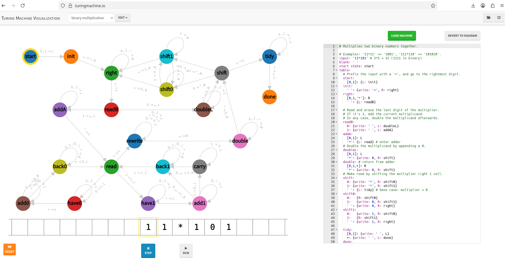

Aqui temos uma multiplicação de dois números binários. A mesma coisa como uma FSM pura teria um
número enorme de estados enquanto aqui só foram necessários 21 estados. Mas isto foi criado apenas
para estudar um problema matemático do tipo "existe uma Máquina de Turing capaz de ..." e não
ser algo prático. Cada problema requer a construção de uma Máquina de Turing própria, mas no final
do texto aparece uma proposta interessante: uma Máquina Universal de Turing que receberia na mesma
fita os dados de entrada e uma representação, na forma de uma sequência de símbolos, de
uma Máquina de Turing que resolva o problema desejado. Hoje chamamos isso de "interpretador". Uma
vez construida esta máquina, trocando a fita muda o funcionamento. É o que chamamos de "software".

## Arquitetura de von Neumann e de Harvard

O primeiro computador (ou "cérebro eletrônico" conforme a imprensa da época) divulgado para o público
foi o Eniac em 1946 (projetos anteriores foram mantidos em segredo por muitos anos). Projetado
por John Mauchly e J. Presper Eckert  na Universidade da Pennsylvania, a principal limitação do
ENIAC era a necessidade de reconfigurar o hardware via paineis de fios para cada novo problema. Então
mesmo durante o seu desenvolvimento eles passaram a discutir o sucessor, a ser chamado de EDVAC.

Um dos participantes destes debates era o John von Neumann e ele escreveu um relatório detalhado
com estas idéias. Outro participante, o Herman Goldstine, acabou distribuindo o relatório para grupos
externos com apenas o von Neumann como autor, por isso este estilo de computação é conhecido como
"arquitetura von Neumann" apesar de ter sido criada por um grupo.

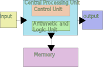

O John von Neumann gostava de analogias com a biologia e por isso chamava as partes do computador de "orgãos"
e onde os dados ficavam de "memória" (outros, especialmente a IBM, preferiam termos como "armazenagem"
mas acabaram perdendo esta batalha).

A únidade de control é uma FSM, que já vimos. A unidade lógica e aritmética é uma versão mais complicada
so somador/subtrator que também já vimos. A entrada e a saída é diferente para cada computador, então vamos
ignorá-los por enquanto.

A memória guarda dados e os programas (como a fita da Máquina Universal de Turing). Um bit desta memória é
como o registrador, que já vimos. O que não falamos é como escolher um bit entre muitos, mas o multiplexador
é bem parecido com o mecanísmo usado. Um aspecto interessante da arquitetura de von Neumann é que o
processador central (CPU) pode ser feito com uma tecnologia completamente diferente da usar pela memória.
Alguns exemplos:

| Computador | CPU | Memória |
|------------|-----|---------|
| EDSAC | válvulas | tanques de mercúrio |
| IAS | válvulas | tubos de Williams |
| LGP-30 | válvulas | tambor magnético |
| PDP-8 | transistores | núclos de ferrite |
| PC moderno | chip digitais | chip com capacitores verticais |

O IAS é "Institute for Advanced Studies" de Princeton onde John von Neumann e equipe construiram o computador
do seu relatório. Por isso também é mais raramente conhecido como "arquitetura de Princeton". Isso é em
contraste com "arquitetura de Harvard" cujo nome é baseado no computador que a IBM construiu para Howard Aiken da
Universidade de Harvard. A única diferença é que a memória de dados e a memória de programas são separadas. A
separação permite uma instrução e um dado serem lidos ao mesmo tempo, o que facilita o projeto. Mas impede
que um programa modifique a si mesmo.

Hoje todos os computadores menos os mais simples são hibridos: diretamente no processador temos duas pequenas
memórias conhecidas como cache de instrução de nível 1 e cache de dados de nível 1. Estas memórias apenas guardam
cópias das informações mais recentes usadas pelo computador. Quando a informação desejada não está nelas, um
cache unificado de nível 2 é acessado. E pode existir um nível 3 de cache e finalmente chegamos à memória
principal única como na figura do von Neumann. Isto combina as vantagens de hardware da arquitetura Harvard
com as vantagens de programação da arquitetura von Neumann.

Mencionamos que as entradas e saídas são específicas para cada computador. Nos primeiros computadores isso se
refletia no conjunto de instruções. Um computador podia ter uma instrução para ler uma tecla e outra instrução
para gravar numa fita. Por volta de 1970 começou a ficar popular a idéia de fazer os dispositivos aparecerem
como posições especiais de memórias. Ai o processador podia usar as instruções "normais" para tudo. Dos
processadores mais usados, apenas o x86 (Intel e AMD) ainda usam instruções especiais para entrada e saída
e os outros usam "periféricos mapeados na memória", o que nós também faremos.

## MCPU16h

No relatório do EDVAC foi apresentada a idéia de representar um programa como uma série de números, onde os
bits mais significativos representariam a "ordem" sendo dada ao computador (hoje chamamos isso de "código de
operação", ou "opcode" reduzido em inglês) e os menos significativos o endereço da posição de memória a ser
usada nesta instrução. Muitas operações precisam de dois operandos e produzem um resultado que precisa
ser armazenado em algum lugar. Isso exigiria 3 endereços, mas o EDVAC herdou das calculadoras mecânicas a
idéia de um registrador especial chamado "acumulador" que serve de um dos operando e o destino do resultado
na maioria das instruções.

Quantas instruções diferentes vamos ter? Isso define quantos bits iremos precisar para o "opcode". Na verdade
é possível fazer tudo com uma única instrução, mas isso não é uma boa idéia do ponto de vista didático. Um
exemplo é as instrução SUBLEQ que tem 3 endereços, e subtrai o valor no primeiro endereço do que está no
segundo endereço (guardando o resulto ali) e se o resultado foi negativo ou igual ele salta para o terceiro
endereço. Programas escritos para um computador assim são quase tão difíceis de se entender quanto os da
Máquinda de Turing.

Uma alternativa mais razoável é o [MCPU](https://github.com/cpldcpu/MCPU) com suas 4 instruções (dois bits
para o "opcode"). O Tim Böscke foi inspirado pelo MPROZ com suas 3 instruções, mas a troca
das operações de memória para memória por um acumulador estilo EDVAC simplificou bastante o projeto.

O MCPU16h tem duas diferenças: enquanto o MCPU original tem 8 bits de largura e só sobravam 6 bits para o endereço
(apenas 64 bytes, o suficiente para os exemplos mais simples) o MCPU16h, como o nome diz, é de 16 bits
e os 14 bits de endereço permitem 16 mil palavras de 16 bits cada uma (32KB). E o "h" no fim do nome é
de Harvard. Só que como o EDVAC, o MCPU16h depende de poder modificar um programa enquanto executa mas
isso não é possível com a arquitetura Harvard. Só que o *Digital* tem uma memória de duas portas e vamos
usar isso para parecer que são duas memórias separadas mas o que é escrito numa pode ser lido na outra.

A escolha da arquitetura Harvard é para permitir o uso de um circuito combinacional para a unidade de controle.
Na arquitetura von Neumann (como o MCPU original) a leitura da instrução tem que ocorrer num ciclo e a
leitura de um operando no outro. Por isso a unidade de controle precisa ser um circuito sequencial, que é
um pouco mais complexo.

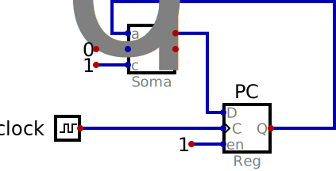

Com este circuito simples, a cada borda de subida do relógio o PC avança para a próxima palavra. Neste caso
ligamos o "enable" do registrador PC em 1 já que nunca deixamos de alterar o PC. Mas num projeto mais completo
vão existir situações em que isso ocorre (se tivermos que esperar pela memória de instruções, por exemplo).

Vamos usar a memória com duas portas. A porta 2 que é limitado à leitura vai servir como memória de instruções.
Os sinais de controle da porta 1 estão ligados a valores constantes que não atrapalhem a operação (não gravando
nada, por exemplo).

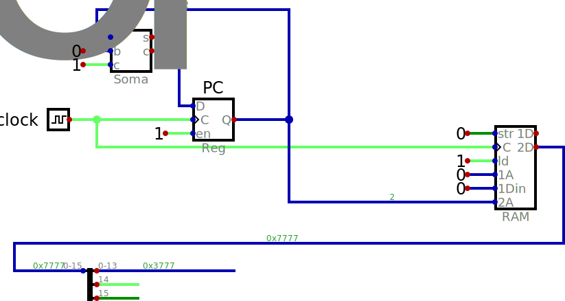

Quando a simulação começa a memória está cheia de 0s. Mais para a frente usaremos o conteúdo de um arquivo para
preencher a memória, mas por enquanto estamos editando os valores das primeiras palavras da memória cada vez
que a simulação começa só para ver que algo está acontecendo. A figura mostra o que acontece depois de duas
subidas do relógio.

O dado vindo da memória (0x7777 indicando que é o hexadecimal equivalente ao binário 0111011101110111) é dividido
num endereço de 14 bits (0x3777) e em dois bits de "opcode" (0 e 1). Estamos decodificando as instruções usando
apenas fios.

Vamos implementar a primeira das quatro instruções: JCC ("Jump if Carry Clear" - pule se o vai um estiver 0).
Precisamos escolher um "opcode" para esta instrução e escolhemos 1 e 1.

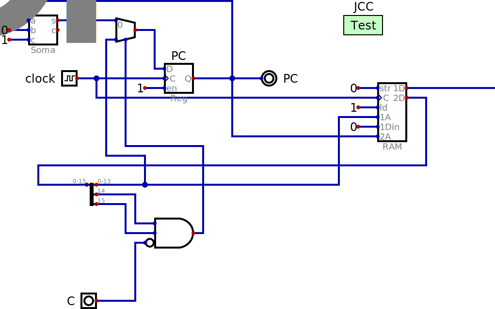

Um multiplexador escolhe entre pular para o endereço indicado pela instrução ou somar 1 ao PC atual. O primeiro
caso só acontece se o opcode é o do JCC e se o bit *C* é 0. A porta AND de 3 entradas determina esta
situação e controla o multiplexador.

Aqui estamos fazendo um único circuito, mas normalmente a porta AND faria parte da unidade de controle enquanto
o multiplexador, registrador de PC e o somador fariam parte do que chamamos de "fluxo de dados". E a memória seria
algo separado da CPU.
```
clock C PC
program(0x0000, 0xC006, 0xC001, 0xC008)
0 1 0
C 1 1
C 1 2
C 0 1
C 1 2
C 0 1
C 0 6
```
Para testar o circuito precisamos tornar o PC uma saída para que possa ser comparado durante o teste. Inicializamos
as 4 primeiras palavras da memória com um pequeno programa de teste. A instrução 0 vai ser ignorada por enquanto e
as instruções 1, 2 e 3 são todas JCC. A primeira vez que a instrução 1 é executada (linha 5 do teste) o *C* é 1 e
PC é incrementado para 2. Na linhas linhas 7 e 9 a instrução 1 é executada outra vez, com *C* igual a 1 e *C* igual
a 0 respectivamente. Apenas no último caso ele não continua para 2, mas sim salta para 6.

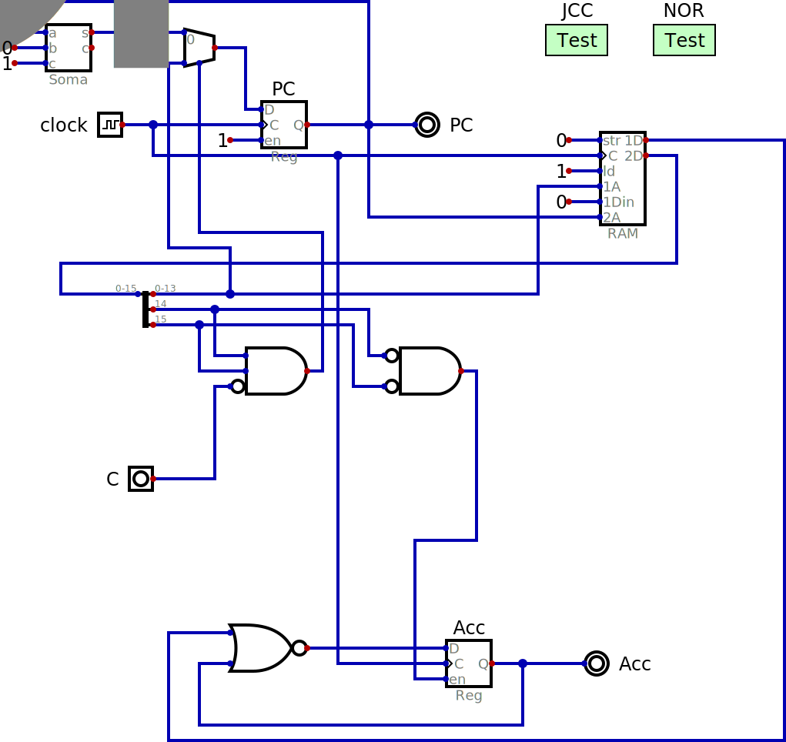

A próxima instrução que vamos implementar é a NOR, para a qual escolhemos o opcode 0 e 0. Para isso precisamos de
um novo registrador de 16 bits que chamaremos de Acc. Teremos uma saída com este nome para poder usar nos testes.
O circuito NOR com largura 16 recebe um dado de Acc e o outro da memória e seu resultado volta para Acc.

Primeiro testamos JCC para ver se continua funcionando. Depois criamos um novo teste para NOR. O circuito precisa
passar pelos dois.
```
clock Acc
program(0x0004, 0x0000, 0x0001, 0x0002, 0xFFFF)
0 0
C 0
C 0xFFFB
C 4
C 0xFFFA
```
Curiosamente as palavras 0, 1 e 2 servem inicialmente como instruções mas depois são usadas como dados também.

A instrução STA ("STore Accumulator") vai ter o opcode 1 e 0. A saída de Acc vai ser o dado de entrada da memória
(que até agora era sempre 0). E o sinal *str* da memória vai ser acionado para esta instrução, gravando o dado
no endereço indicado.

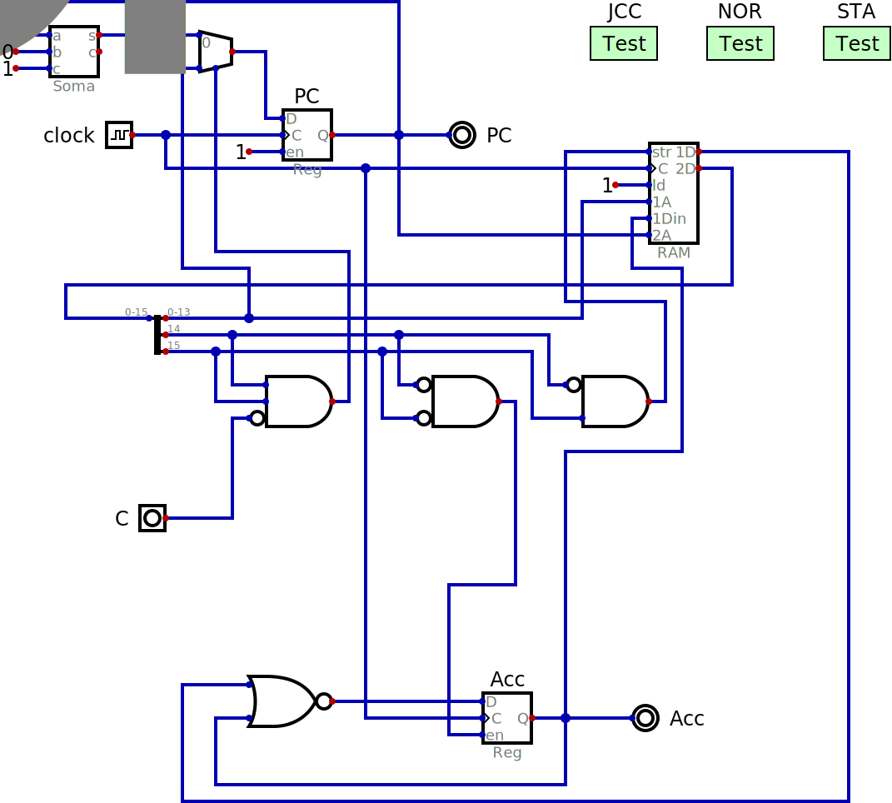

Depois de verificar que os testes de JCC e do NOR continuam funcionando, criamos um novo teste para STA.
```
clock Acc
program(0x0004,0x8004,0xC000,0x0000,0xFFFF)
0 0
C 0
C 0
C 0
C 0xFFFF
C 0xFFFF
C 0xFFFF
C 0
C 0
C 0
C 0xFFFF
```
Não é possível testar STA sem também usar as outras instruções. Os resultados de gravar um dado só é visível
quando se lê de volta o dado e para isso precisamos do NOR. O teste usa JCC também só para manter o código
curto - uma sequência NOR, STA, NOR, STA, NOR... já serviria de teste.

A última instrução, o ADD, seria quase igual ao NOR se não fosse pela complicação do vai um. Mas como tanto
o ADD quanto o NOR escrevem em Acc precisamos de um multiplexador para decidir entre eles.

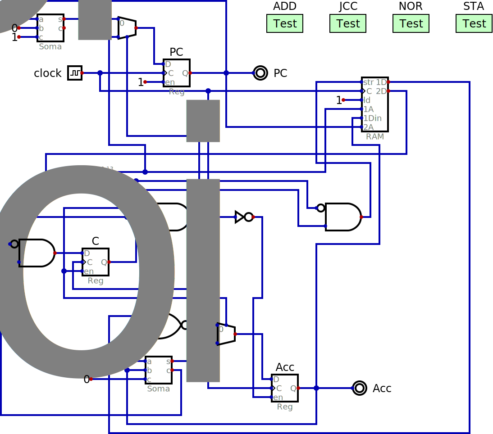

Agora Acc precisa ser habilitado tanto para ADD (opcode 01) quando para NOR (opcode 00), então podemos trocar
a porta AND com as duas entradas invertidas por um inverso. O novo somador tem as mesmas entradas que o NOR.

A entrada *C* é trocada por um registrador *C* de apenas um 1 bit de largura. Isso vai nos obrigar a alterar
o teste JCC. A definição de JCC é que *C* é zerado independentemente se o salto acontece ou não. Isso é usado
para que duas instruções JCC seguidas sejam um desvio incondicional (que em outros processadores seria uma
instrução separada). A saída vai um do somador é forçada a ser 0 no caso de uma instrução JCC (ou de um STA,
mas neste caso não importa).

*C* precisa ser habilitado para as instruções ADD (opcode 01) e JCC (opcode 11), então basta usar diretamente
o bit mais de baixo do opcode.

Com isto o MCPU está completo e poderá executar programas complexos.

### Software

Já escrevemos pequennos programas para o MPCU16h nos testes que criamos. Mas indicar diretamente cada instrução
como um número hexadecimal ou binário, o que chamamos de "linguagem de máquina", fica inviável para programas
com mais de umas 10 instruções. Felizmente um programa chamado "montador" ("assembler" em inglês) pode ler
um texto em que cada linha corresponde a uma instrução em linguagem de máquina e letras indicam a operação
("NOR", "ADD", "STA" e "JCC" no caso do MCPU16h) e gerar a linguagem de máquina correspondente. Podemos marcar
algumas linhas usando rótulos textuais e ai usar este mesmo texto no campo de endereço de outras instruções e ai
o assembler cuida de calcular o valor real dos endereços associados aos rótulos.

Montadores mais avançados, como o *GNU as*, permitem a definição de "macros" que são textos (possivelmente com
parâmetros) que depois são expandidos em todos os lugares onde são usados no programa. Neste projeto usamos
este recurso para fazer uma versão do *as* (para o processador x86, por exemplo) gerar código de máquina para
o MCPU16h. Estas macros ficam no arquivo *mcpu16.inc* que tem em seu início:
```
absStart:
        .macro NOR a
        .word (0x3FFF & ((\a-absStart)/2))
        .endm

        .macro ADD a
        .word (0x3FFF & ((\a-absStart)/2)) | 0x4000
        .endm

        .macro STA a
        .word (0x3FFF & ((\a-absStart)/2)) | 0x8000
        .endm

        .macro JCC a
        .word (0x3FFF & ((\a-absStart)/2)) | 0xC000
        .endm
```
Um programa que inclua este arquivo vai poder escreve algo como "JCC myLoop" e os 16 bits correspondentes serão
gerados. Uma complicação é que *as* encara que um rótulo como "myLoop" é um valor relativo e não conseguiria,
em princípio, calcular a expressão que gera a instrução. A idéia é que um programa pode ser feito de vários
módulos e o montador traduz cada um e uma etapa posterior junta os módulos no programa final. Ai os endereços
só serão conhecidos depois disso. Mas os programas que escreveremos para o MCPU16h são relativamente simples e
não teremos mais de um módulo. Por isso definimos "absStart" como sendo o início do programa para que a
expressão "myLoop-absStart" seja um valor conhecido pelo montador.

Além das 4 instruções que o hardware entende, podemos aproveitar as macros para definir novas instruções como
pequenas sequências destas instruções. Por exemplo: CLR (limpa o acumulador para zero), LDA (carrega um valor
no acumulador), LDP (carrega um ponteiro no acumulador), LDI (carrega indiretamente no acumulador), NOT
(inverte o acumulador), JMP (pula incondicionalmente), JCS (pula se o *C* for 1), SUB (subtrai o acumulador
do valor) e CALL (chamada de subrotina). O uso destas "pseudo-instruções" gera programas um tanto grandes. Os
programas do MCPU16h são umas 10 vezes maiores do que os para processadores mais razoáveis.

As pseudo-instruções IN e OUT leem e gravam do último endereço da memória e o circuito deve detectar isso
e ler ou gravar de um periférico no lugar da memória. Também foram definidas as macros STARTCOUNT e COUNT
para controlar um circuito para medir a velocidade para comparação de diferentes processadores. Neste
projeto não implementaremos este circuito e estas pseudo-instruções irão mexer com a penúltima palavra da
memória sem nenhum efeito.

O comando "make", entre outras coisas, gera os arquivos .hex que usaremos para inicializar a memória em nossas simulações
no diretório *hex* usando os códigos fontes .S encontrados no diretório *soft*. Os programas *as* e
*objcopy* são usados pelo *make*. Mais para frente usaremos *riscv32-unknown-linux-gnu-as* no lugar do *as*
para cuidar de programas para o RISC-V. Usaremos .s (minúsculo) nos nomes do código fonte neste caso
para o *make* poder decidir qual montador usar.

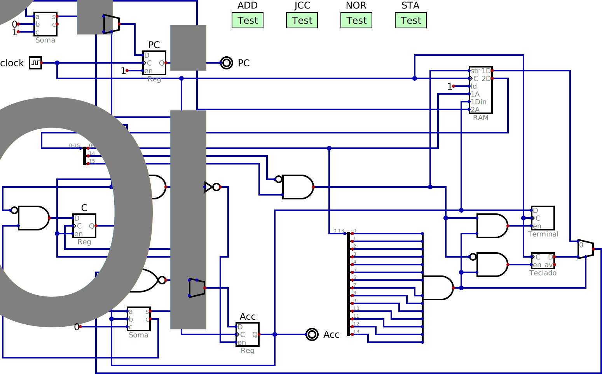

O novo circuito está na parte inferior à direita. Um AND de 14 entradas indica quando o último endereço da
memória (0x3FFF) é acessado e neste caso o novo multiplexador seleciona o dado vindo do teclado para as
instruções NOR e ADD (enquanto STA e JCC nem usam este dado) ao invés da memória, que é selecionado para
qualquer outro endereço. Duas portas AND separado o acesso ao último endereço entre os casos de escrita
(STA) e leitura (qualquer outra instrução). A escrita vai para o terminal e a leitura vem do teclado.

A memória pode ser configurada como "Memória de programa" e na "Configuração específicas do circuito"
podemos indicar o arquivo *hex/3.01.testTerminal.hex* como "Arquivo de programa". Isto foi gerado de
```
.include "mcpu16.inc"

loop:
        LDA cp
        ADD adInst
        STA 0f
        CLR
0:      .word 0  /* will be replaced */
        STA char
        ADD minusOne
        JCC halt    /* zero terminated string */
        LDA char
        OUT
        LDA cp
        ADD one
        STA cp
        JMP loop

halt:   JMP halt

text:   .string16 "Hello world!"
cp:     .word (text-absStart)/2
char:   .word 0
```
Podemos executar este programa passo a passo clicando repetidamente na entrada *clock*. Se o *Digital*
abrir uma janela e escrever o texto esperado podemos considerar que o processador está funcionando
completamente (a instrução NOR não aparece na listagem mas é usada por pseudo-instruções como LDA).

Para uma segunda execução deste programa podemos configurar a entrada *clock* para pulsar em tempo
real.

Trocando a inicialização da memória por *hex/3.02.sine.hex* veremos uma senoide desenhada na tela
textualmente. O algorítmo CORDIC evita usar multiplicações.

Um terceiro exemplo é o jogo interativo 2048. O terminal mostra uma matriz de 4 por 4 números que
podem ser deslocado para cima, equerda, baixo ou direita pressionando teclas na pequena janela
entitulada "Teclado". O arquivo para a memória é *hex/3.03.term20248.hex*.

## drv32h

Em 2010 um grupo de pesquisa da Universidade da Califórnia Berkeley estava desenvolvendo um
circuito que precisava incluir um processador. Depois de avaliarem as alternativas disponíveis
eles resolveram que a melhor opção seria um projeto próprio. Afinal, este mesmo grupo tinha
criado o processador RISC em 1982 e o RISC II em 1983. O SOAR ("Smalltalk On A RISC") de 1984
e o SPUR de 1988 tinham continuado nesta tradição. Então o novo processador seria o quinto
desta linhagem: o RISC-V.

Eles definiram um conjunto bem pequeno de instruções mas com espaço para ter extensões opcionais.
A base pode ser de 32 bits (RV32I ou RV32E), 64 bits (RV64I ou RV64E) ou ainda 128 bits (RV128I).
As variantes "I" e "E" são idênticas fora o fato da "I" ter 32 registradores e a "E" apenas 16.

Um exemplo de extensão é a "M" que adiciona instruções de multiplicação e divisão. As instruções
básicas já são suficientes para implementar estas funções, mas instruções próprias podem
acelerar bastante certas aplicações ao custo de um hardware mais caro. A maioria das extensões
são como esta onde uma coisa que já era possível fica mais rápida. Uma extensão que traz nova
funcionalidade é a "A" que introduz instruções atômicas. Sem estas instruções não dá para
vários processadores ligados numa única memória coordenarem suas atividades.

Com o interesse crescente de empresas e pesquisadores fora de Berkeley pelo projeto foi
criada uma [fundação independente](https://riscv.org) para organizar a padronização e evolução da arquitetura.

No drv32h (RISC-V no Digital com base RV32I e arquitetura Harvard) iremos implementar apenas
as instruções da base e nenhuma das extensões.

### Instruções

Detalhes sobre as instruções do RISC-V podem ser encontradas na [especificação oficial](https://docs.riscv.org/reference/isa/_attachments/riscv-unprivileged.pdf)
ou nos [slides deste curso de 2022](https://gse.ufsc.br/bezerra/wp-content/uploads/2022/04/Lecture7.pdf).

As instruções básicas do RISC-V são de 32 bits, mas os dois bits de baixo são sempre 1 e 1. As
outras 3 combinações são usadas pela extensão "C" que usa instruções de 16 bits para tornar
os programas mais compactos. Os 7 bits de baixo são o código de operação e sem a extensão
"C" temos 32 combinações possíveis:

|         | 00...11 | 01...11 | 10...11 | 11...11 |
|---------|---------|---------|---------|---------|
| ..00011 | LOAD    | STORE   | MADD    | BRANCH  |
| ..00111 | LOAD-FP | STORE-FP| MSUB    | JALR    |
| ..01011 | cust0   | cust1   | NMSUB   | reserved|
| ..01111 | MISC-MEM| AMO     | NMADD   | JAL     |
| ..10011 | OP-IMM  | OP      | OP-FP   | SYSTEM  |
| ..10111 | AUIPC   | LUI     | reserved| reserved|
| ..11011 | OP-IMM32| OP32    | cust2   | cust3   |
| ..11111 | 48 bits | 64 bits | 48 bits | >=80 bits|

Apenas iremos implementar as instruções individuais JALR, JAL, AUIPC e LUI e os grupos de
instruções LOAD, STORE, BRANCH, OP-IMM e OP. Estas são apenas 9 das 32 possibilidades do
código principal de operação. Os grupos de instruções usam campos auxiliares de código
de operação para escolher as instrução individual.

As instruções MADD, MSUB, NMSUB e NMADD e os grupos LOAD-FP, STORE-FP e OP-FP são para
as extensões de ponto flutuante: "F" (ponto flutuante de 32 bits), "D" (ponto flutuante de
64 bits) e "Q" (ponto flutuante de 128 bits). Não usaremos isso no nosso projeto.

Os 5 bits de baixo são todos 1 para instruções maiores que 32 bits, mas nenhuma foi definida.
Os grupos OP-IMM32 e OP32 são para permitir que um RV64I ou RV128I possam também fazer
operações de 32 bits, mas num RV32I como o drv32h estas instruções não são usadas.

As marcadas como "reserved" serão usadas por extensões oficiais enquanto as "custX" são
onde extensões não oficiais devem ser implementadas.

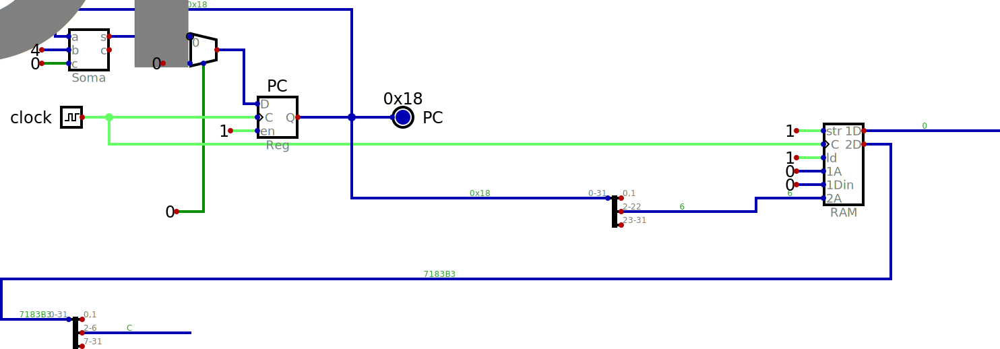

Eliminando a maior parte do circuito do MCPU16h voltamos a ter praticamente só o PC. Para o
drv32h aumentamos o PC de 14 para 32 bits (e também o multiplexadore o somador) e trocamos
o valor a ser somado para 4. Antes de enviar o valor de PC para ser um endereço de memória
descartamos os dois bits de baixo que serão usados para escolher um byte dentro de uma
palavra de 32 bits. A largura da memória também é 32 bits mas só aumentamos o endereço
para 21 bits (o que dá 8MB no total). Assim, quando o PC endereçar o byte 0x18 a memória
vai ler a palavra 6. Como os 9 bits de cima do endereço não estão ligados, a memória vai
se repetir 512 vezes pelo espaço de 4GB.

Inicializamos a memória com *hex/3.04.sine.hex* que é a versão para RISC-V do mesmo programa
que o MCPU16h rodou como *hex//3.02.sine.hex*. Enquanto este último arquivo tem 6874 bytes,
a versão RISC-V tem apenas 373 bytes.

Separamos a instrução lida nos dois bits de baixo (que devem sempre ser 1 e 1), 5 bits de
código principal de operação correspondentes à tabela logo acima e os demais bits.

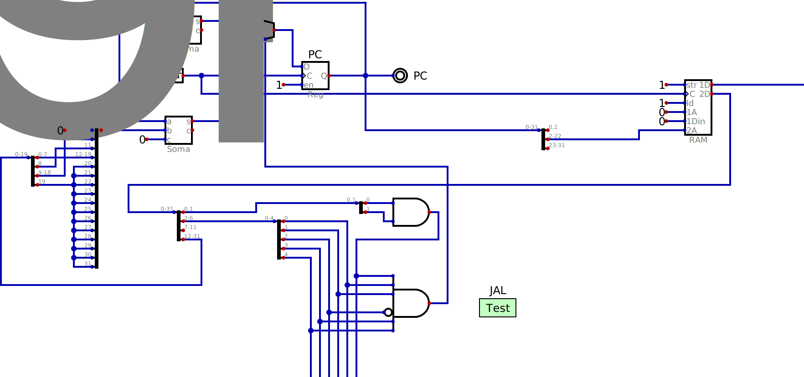

A primeira instrução a ser implementada é a JAL ("Jump And Link") que serve para desvios
incondicionais e chamadas de subrotina. Ela tem um campo com o registrador de destino mas
como estes ainda não existem o campo não está ligado a nada por enquanto. Um valor immediato
de 20 bits a ser somado ao PC é codificado de maneira meio complicada. Um segundo somador
está sendo usado para addicionar o valor imediato ao PC e enviar o resultado ao multiplexador que já
tínhamos deixado dos projetos anteriores. Uma idéia que parece viável seria ter o multiplexador
na entrada do somador original selecionando entre a constante 4 e o valor imediato. Mas
isso só daria certo pelo JAL ainda estar incompleto. O valor a ser armazenado no registrador
de destino é justamente o PC+4 e o único jeito de ter isso e o PC+imediato é termos dois
somadores separados.

Uma porta AND de 6 entradas mais outra de 2 entradas detectam que os 7 bits de baixo da
instrução correspondem ao JAL. A saída delas é usada para controlar o multiplexador.

O teste corresponde a:
```
loop:   nop
        jal x31, loop
```

O PC alterna entre 0 e 4.

Em seguida veremos dois grupos de instruções bem parecidos: OP e OP-IMM.

| grupo | instrução | funct7  |      | funct3 | função |
|-------|-----------|---------|------|--------|--------|
| OP    | ADD       | 0000000 | rs2  | 000 | rd := rs1 + rs2 |
| OP-IMM| ADDI      | imm     | imm  | 000 | rd := rs1 + imm |
| OP    | SUB       | 0100000 | rs2  | 000 | rd := rs1 - rs2 |
| OP    | SLL       | 0000000 | rs2  | 001 | rd := rs1 << rs2 |
| OP-IMM| SLLI      | 0000000 | imm  | 001 | rd := rs1 << imm |
| OP    | SLT       | 0000000 | rs2  | 010 | rd := rs1 < rs2 |
| OP-IMM| SLTI      | imm     | imm  | 010 | rd := rs1 < imm |
| OP    | SLTU      | 0000000 | rs2  | 011 | rd := rs1 < rs2 (sem sinal) |
| OP-IMM| SLTIU     | imm     | imm  | 011 | rd := rs1 < imm (sem sinal) |
| OP    | XOR       | 0000000 | rs2  | 100 | rd := rs1 XOR rs2 |
| OP-IMM| XORI      | imm     | imm  | 100 | rd := rs1 XOR imm |
| OP    | SRL       | 0000000 | rs2  | 101 | rd := rs1 >> rs2 (sem sinal) |
| OP-IMM| SRLI      | 0000000 | imm  | 101 | rd := rs1 >> imm (sem sinal) |
| OP    | SRA       | 0100000 | rs2  | 101 | rd := rs1 >> rs2 |
| OP-IMM| SRAI      | 0100000 | imm  | 101 | rd := rs1 >> imm |
| OP    | OR        | 0000000 | rs2  | 110 | rd := rs1 OR rs2 |
| OP-IMM| ORI       | imm     | imm  | 110 | rd := rs1 OR imm |
| OP    | AND       | 0000000 | rs2  | 111 | rd := rs1 AND rs2 |
| OP-IMM| ANDI      | imm     | imm  | 111 | rd := rs1 AND imm |

A única diferença entre os dois grupos é a falta de um SUBI, mas como o valor imediato é
com sinal esta instrução é desnecessária.

Duas novas portas AND de 6 entradas indicam os grupos OP e OP-IMM. Trocamos a saída *PC*
por uma ponta de prova *PC*. Ocupa menos espaço e os testes podem usar do mesmo jeito.
Também colocamos sondas *JAL*, *OP* e *OP-IMM* para poder testar estes sinais.

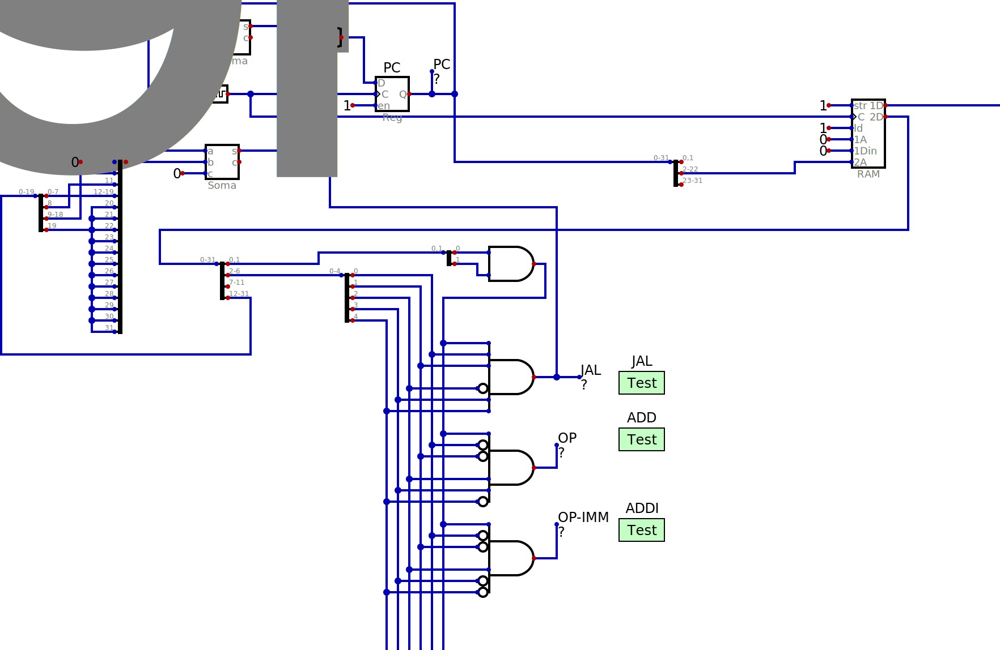

Para funcionarem corretamente uma das coisas que estas instruções precisam é de um banco
de registradores. O RV32I tem 32 registradores de 32 bits cada, mas o registrador *x0* (também
conhecido como "zero") ignora todas as escritas e retorna sempre 0 quando lido. Depois de
contruido o banco repetindo 4 vezes blocos de 8, o registraddor *x0* foi apagado e onde
estava sua saída foi inserida a constante 0.

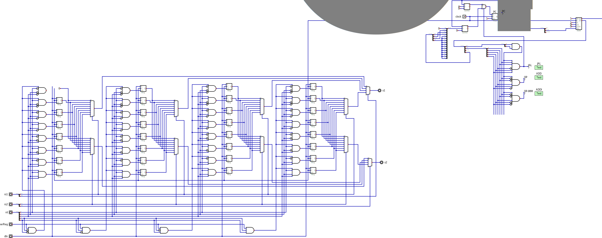

Com os registradores ligados a saídas e entradas dá para testá-los manualmente independentemente
do resto do circuito.

Escrever programas diretamente em hexadecimal é muito tedioso. Para desenvolver os testes
foi chamado o *as* para RV32I na linha de comando de modo que ele leia da entrada padrão e
gere a saída quando é digitado control-D. Dai é só copiar o código como comentários no
teste. Mesmo assim é fácil cometer erros ao converter da notação "little endian" da listagem
para números de 32 bits.

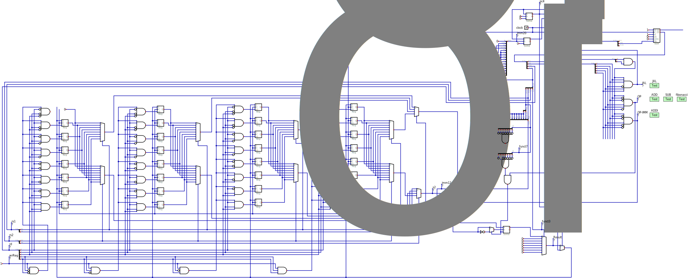

Os 32 bits da instrução são separados em campos conforme o padrão RISC-V. 3 campos de 5 bits
são os endereços para o banco de registradores. Um campo de 3 bits pode ser usado diretamente
como controle de um multiplexador para escolher qual circuito vai produzir o resultado. A
primeira entrada vem de um somador mas a segunda entrada do somador pode ser invertida para uma
subtração. Os 7 bits mais significativos da instrução tem apenas dois padrões válidos para
as instruções que estamos implementando: 0000000 ou 0100000. O segundo caso (combinado com
a indicação de que é OP e não OP-IMM já que estes bits podem ocorrer num valor imediato)
transforma a soma em subtração.

Um multiplexador seleciona o valor a ser escrito num registrador entre o resultado calculado
e o somador PC+4 (para a instrução JAL).

Com estas instruções já é possível ter um programa de testes que calcula os números de
Fibonacci.

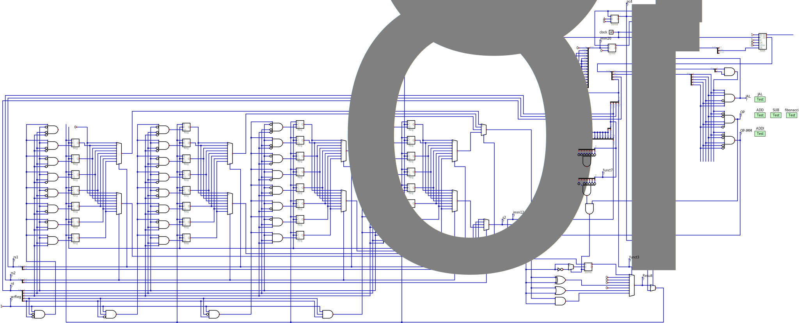

Com toda esta infraestrutura implementada, adicionar as seis operações lógicas (3 OP e
3 OP-IMM) é muito facil: são as 3 portas de largura 32 bits na parte inferior direita.

Já a comparação de dois números de 32 bits existem dois resultados diferentes possíveis:
se os dois números forem considerados sem sinal ou se os dois números forem considerados
como sendo a representação em complemento de dois. Não faz sentido comparar números de
representações diferentes.

Estes são os resultados de subtrair dois números de 3 bits cada um ao nível binário (com
o vai um do bit 2 mostrado à esquerda antes da vírgula e o vai 1 do bit 1 mostrado à
direita entre parênteses):

|     |  000      |  001      | 010       |  011      | 100       | 101       | 110       | 111       |
|-----|-----------|-----------|-----------|-----------|-----------|-----------|-----------|-----------|
| 000 | 1,000 (1) | 1,001 (1) | 1,010 (1) | 1,011 (1) | 1,100 (1) | 1,101 (1) | 1,110 (1) | 1,111 (1) |
| 001 | 0,111 (0) | 1,000 (1) | 1,001 (1) | 1,010 (1) | 1,011 (0) | 1,100 (1) | 1,101 (1) | 1,110 (1) |
| 010 | 0,110 (0) | 0,111 (0) | 1,000 (1) | 1,001 (1) | 1,010 (0) | 1,011 (0) | 1,100 (1) | 1,101 (1) |
| 011 | 0,101 (0) | 0,110 (0) | 0,111 (0) | 1,000 (1) | 1,001 (0) | 1,010 (0) | 1,011 (0) | 1,100 (1) |
| 100 | 0,100 (1) | 0,101 (1) | 0,110 (1) | 0,111 (1) | 1,000 (1) | 1,001 (1) | 1,010 (1) | 1,011 (1) |
| 101 | 0,011 (0) | 0,100 (1) | 0,101 (1) | 0,110 (1) | 0,111 (0) | 1,000 (1) | 1,001 (1) | 1,010 (1) |
| 110 | 0,010 (0) | 0,011 (0) | 0,100 (1) | 0,101 (1) | 0,110 (0) | 0,111 (0) | 1,000 (1) | 1,001 (1) |
| 111 | 0,001 (1) | 0,010 (0) | 0,011 (0) | 0,100 (1) | 0,101 (0) | 0,110 (0) | 0,111 (0) | 1,000 (1) |

No caso da comparação sem sinal, os resultados equivalentes são:

|   | 0 | 1 | 2 | 3 | 4 | 5 | 6 | 7 |
|---|---|---|---|---|---|---|---|---|
| 0 | = | > | > | > | > | > | > | > |
| 1 | < | = | > | > | > | > | > | > |
| 2 | < | < | = | > | > | > | > | > |
| 3 | < | < | < | = | > | > | > | > |
| 4 | < | < | < | < | = | > | > | > |
| 5 | < | < | < | < | < | = | > | > |
| 6 | < | < | < | < | < | < | = | > |
| 7 | < | < | < | < | < | < | < | = |

Comparando as duas tabelas vemos que "menor sem sinal" (LTU das instruções SLTU e BLTU) é só o NOT do
vai um do bit 2.

Para comparações com sinal os resultados são:

|    | +0 | +1 | +2 | +3 | -4 | -3 | -2 | -1 |
|----|----|----|----|----|----|----|----|----|
| +0 | =  | >  | >  | >  | <  | <  | <  | <  |
| +1 | <  | =  | >  | >  | <  | <  | <  | <  |
| +2 | <  | <  | =  | >  | <  | <  | <  | <  |
| +3 | <  | <  | <  | =  | <  | <  | <  | <  |
| -4 | >  | >  | >  | >  | =  | >  | >  | >  |
| -3 | >  | >  | >  | >  | <  | =  | >  | >  |
| -2 | >  | >  | >  | >  | <  | <  | =  | >  |
| -1 | >  | >  | >  | >  | <  | <  | <  | =  |

É muito mais complicado ver em que casos a reposta é menor com signal, mas se observarmos o vai um do
bit 2, o vai um do bit 1 e o bit 2 da soma veremos que a resposta é menor sempre que o número de 1s
destes 3 bits é ímpar. O XOR dos dois primeiros bits está disponível em vários processadores como
indicador *V* ("overflow") que significa que os bits produzidos no resultado não são os corretos.
Com 3 bits não é possível representar todas as respostas. Somando 5 e 5 sem sinal, a reposta será
dez e isso precisaria de 4 bits. Somando 2 e 3 com sinal a resposta seria cinco, mas isso representa -3
em complemento de dois. Um valor positivo de *V* indica estas situações para que o software descarte o
resultado. Já um XOR de *V* com o sinal da resposta indica a operação "menor com signal".

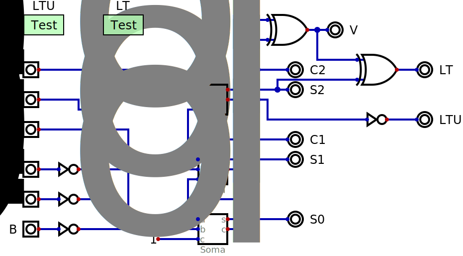

Normalmente faríamos um esforço para reaproveitar o circuito de SUB para as instruções SLT, SLTU,
SLTI e SLTIU (além dos desvios condicionais, que ainda não vimos). Mas aqui usamos um somador
separado e ai tem um para os 31 bits de baixo e outro só para o bit mais significativos, o que
gera todos os sinais que precisamos para as comparações.

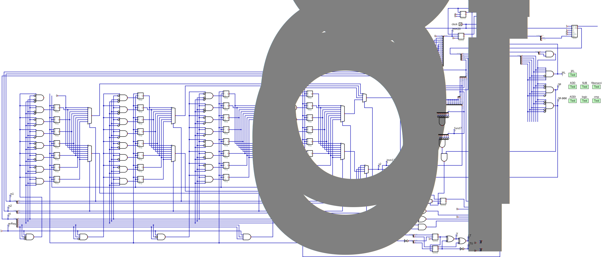

As instruções de deslocamento exigem muito hardware adicional. Para deslocar à esquerda por apenas
um dígito basta somar um valor a si mesmo. Mas para deslocar para a direita podemos usar um
multiplexador para selectionar uma versão deslocada do valor (o que pode ser feito com apenas fios).
O dígito mais da direita vai desaparecer e precisamos escolher que bit colocar no dígito mais da
esquerda. Se considerarmos números sem sinal o novo bit deverá ser 0 enquanto para números com sinal
o certo é copiar o valor anterior deste mesmo bit.

Muitos processadores ou tinham instruções que deslocavam por um único dígito ou então permitiam
qualquer número de dígitos mas demoravam um ciclo de relógio por dígito. A primeira opção é
incompatível com o padrão RISC-V enquanto a segunda não se encaixa no estilo do resto do drv32h
que executa todas as instruções num único ciclo.

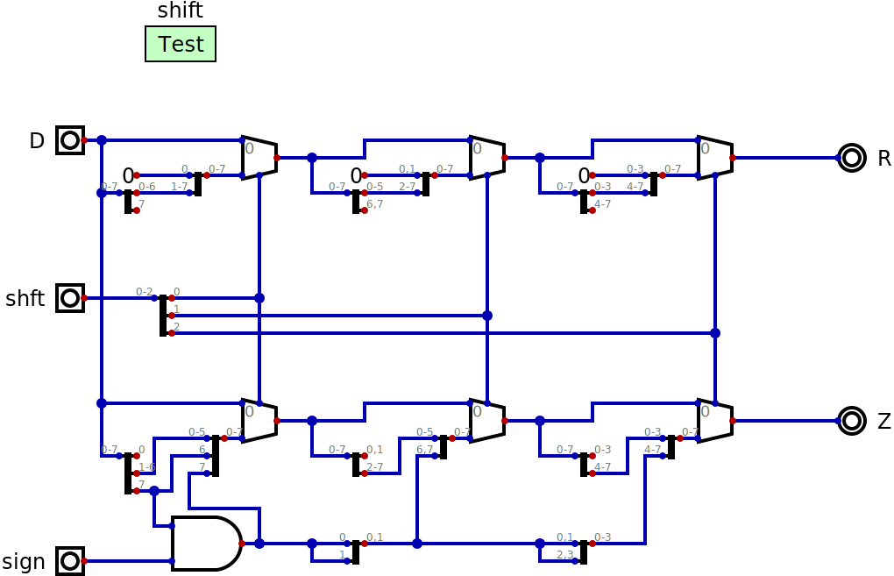

Uma maneira de se deslocar por qualquer número de dígitos em um único ciclo de relógio é trocar
o deslocador único pelo qual o dado passa N vezes por N deslocadores em série. Só que para 8 bits
seriam necessários 8 deslocadores (multiplexadores) e para 32 bits seriam 32 deslocadores, o que
é um circuito muito grande e lento.

Uma solução mais elegante é fazer alguns destes deslocadores moverem os bits mais de um dígito
de cada vez. O primeiro deslocador poderia move por 1 dígito, o segundo por 2 dígitos, o terceiro
por 4 dígitos e depois por 8, 16 e assim por diante. Ai acontece uma coisa interessante - cada
bit do segundo operando pode controlar diretamente um dos deslocadores. Se o operando for 5 (00101
em binário) nós deslocamos por 1, mas não por 2, sim por 4, mas não por 8 e nem por 16. Fica
muito símples o circuito. No circuito de teste vemos 3 deslocadores para 8 bits.

Na metade de cima do circuito de teste temos o deslocamento para esquerda. Em cada estágio o
multiplexador passa o dado inalterado se o bit correspondente do segundo operando for 0 ou seleciona
um deslocamento criado apenas com fios. Em termos de desenho os 3 estágios parecem iguais, mas
os fios e as contantes 0 tem larguras diferentes.

Na metade de baixo o deslocamento para a direita é um pouco mais complicado, pois ao invés do
valor a ser inserido ser sempre 0 (mas com o dobro de bits a cada estágio) ele é o bit 7 do dado
original ou (via porta AND) 0 dependendo de se queremos uma instrução SRL ou SRA. Expandindo
a idéia para 5 estágios de 32 bits teremos as últimas instruções OP e OP-IMM.


A próxima instrução será o JALR que fica meio termo entre o JAL e as OP-IMM. Na verdade iremos
querer ser como o OP-IMM para o JALR, LOAD e STORE e por isso vamos modificar o sinal de controle
do multiplexador que seleciona entre R[rs2] e imm12. Da mesma forma, modificaremos o sinal para
o multiplexador que seleciona entre o resultado e PC+4 para serem escritos no registrador. Um
novo multiplexador seleciona entre o cálculo que o JAL já fazia e o resultado da ALU (que vai
ser uma soma já que a instrução JALR tem um funct3 igual a 0).

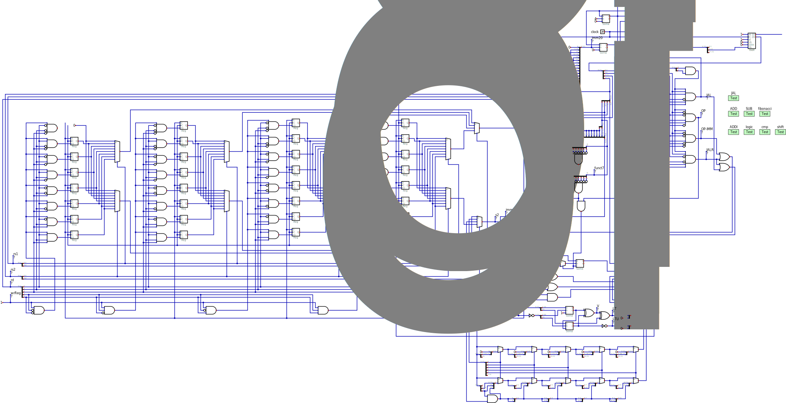

No teste da instrução JALR já podemos ter uma pequena subrotina que é chamava usando a instrução
JAL e depois retorna usando JALR. O outro uso de JALR é para seguir ponteiros para funções e
implementar desvios calculados como em estruturas switch/case de linguagens de programação.

Ainda no desvios, podemos implementar os desvios condicionais para encerrar esta parte. Estes
comparam dois registradores e se a comparação for a desejada ele soma o valor imediato (também
de 12 bits, mas tirados de bits diferentes de OP-IMM e JALR) ao PC mas se a comparação não der
certo a instrução não faz nada. Já implementamos 4 das 6 comparações necessárias como parte
de SLT e SLTU. Falta poder comparar se dois números são iguais. Geralmente isso é feito vendo
se a subtração (que fizemos para as outras duas comparações) teve resultado zero. Mas também
fizemos o XOR dos dois operandos e se algum bit (testando com um OR de 32 entradas) disso for
1 então os números não são iguais. A mesma funct3 que escolhe os resultados da ALU controla
um novo multiplexador de 8 entradas que escolhe a comparação a ser feita. Duas das comparações
não estão definidas (por isso as forçamos a sempre serem falso) e as outras são diferente, LT e
LTU bem como seus inversos (igual, GE e GEU).

Os desvios condicionais são as primeiras instruções que estamos implementando que não gravam
um resultado no banco de registradores (a STORE é a outra que veremos). Usamos o sinal *branch* antes
deste ser combinado com a comparação já que deixamos de gravar no registrador independentemente
de desviarmos ou não.

Podemos aproveitar o somador do JAL com um multiplexador para escolher entre o imm20 que ele soma
ao PC e o imediato especial dos desvios. O novo imediato é escolhido quando temos um desvio e
a condição é verdadeira. O OR de JAL e JALR é expandido para também receber este sinal e
selecionar PC+imm no lugar de PC+4.

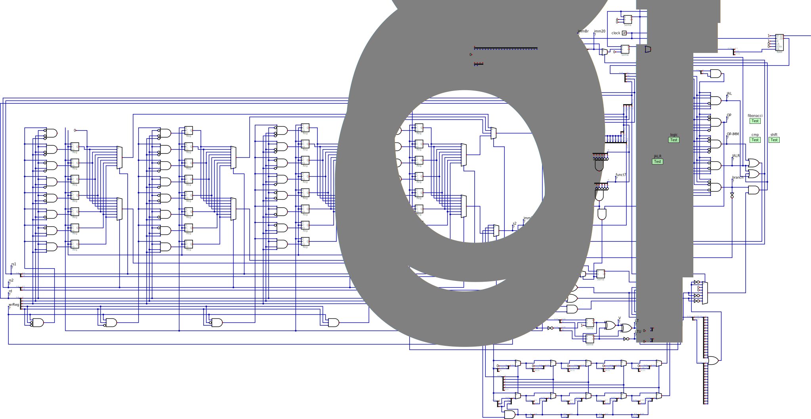

Na criação de um teste para os desvios foi percebido um erro que já estava desde o início: o
sinal *str* da memória estáva acionado sempre, de modo que a cada instrução a segunda porta
estava escrevendo 0 no endereço 0. Como o teste de desvios foi o primeiro a tentar executar
a instrução em 0 uma segunda vez foi a primeira vez que o problema foi visto (e agora corrigido).
Isso é, infelizmente, típico. Os testes são escritos para tentar observar problemas que imaginamos,
mas os problemas que não imaginamos e não testamos diretamente existem.

As duas instruções seguintes (LUI e AUIPC) não são necessárias, mas são convenientes. A maioria
dos outros processadores não tem algo parecido. O uso de valores imediatos de apenas 12 ou 20
bits parece um grande limite, mas com as instruções já implementadas podem ser usadas para
carregar um valor qualquer de 32 bits (0x12345678, por exemplo) em um registrador:
```
    addi x6,zero,(0x12345678>>22)&0x7FF
    slli x6,x6,11
    addi x6,x6,(0x12345678>>11)&0x7FF
    slli x6,x6,11
    addi x6,x6,0x123445678&0x7FF
```
Implementar LUI não cria funcionalidade nova, mas reduz o código acima para apenas duas instruções:
```
    lui x6,0x12345678>>12
    addi x6,x6,0x12345678&0x0FFF
```
O montador oferece a pseudo-instrução "li x6,0x12345678" que vira o código acima. Também omite o LUI
se a constante couber em 12 bits. E também leva em conta que o valor do imediato do ADDI é com sinal
e ajusta o imediato do LUI se for necessário para o resultado final ficar certo.

Como podemos carregar qualquer valor de 32 bits num registrador, a instrução JALR pode pular para
qualquer lugar na memória e o limite do JAL não é realmente um problema. Mas o JAL é um desvio
relativo, o que permite um trecho de código ser copiado para outro endereço e continuar funcionando
(necessário se formos juntar vários módulos num único executável). Podemos calcular um destino
relativo ao custo de um registrador à mais:
```
        li x6,0x01000000
        jal x7,next
next:   addi x6,x6,x7
        jalr zero,-4(x6)
```
As 3 primeiras instruções podem ser trocadas por um AUIPC e ai o JALR não precisa compensar o PC+4 do JAL
e sim fornecer os 12 bits de baixo do desvio (e o valor do imediato do AUIPC pode ter que ser ajustado se
o JALR tiver um imediato negativo).

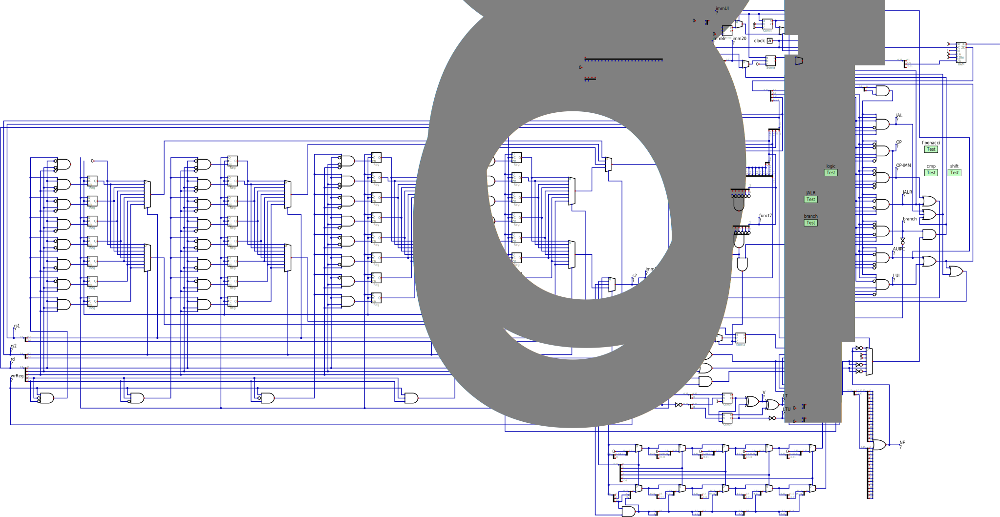

Para verificar que estmos indo na direção certa:

| instrução       | PC :=        | reg[rd] :=   |
|-----------------|--------------|--------------|
| OP              | PC+4         | Result       |
| OP-IMM          | PC+4         | Result imm12 |
| JAL             | PC+imm20     | PC+4         |
| JALR            | Result imm12 | PC+4         |
| desvio cond sim | PC+immBr     | x            |
| desvio cond não | PC+4         | x            |
| AUIPC           | PC+4         | PC+immUI     |
| LUI             | PC+4         | immUI        |
| LOAD            | PC+4         | dMem (rs1+imm12) |
| STORE           | PC+4         | x (rs1+immS) |

Baseado nisso introduzimos mais um somador (para PC+immUI) e dois multiplexadores: um para selecionar
entre PC+4 e o segundo multiplexador que seleciona entre immUI e PC+immUI. Mais duas porta OR aumentam
os casos em que dois sinais de controle são acionados para incluir as novas instruções.

A tabela tem os grupos de instruções LOAD e STORE. Sem elas tudo funciona mas podemos usar apenas 31
dados de 32 bits cada em nosso programa. O termo "RISC" é um tanto ambíguo: é "computador com conjunto
reduzido de instruções" ou "computador com conjunto de instruções reduzidas"? Uma alternativa é falar
de "arquitetura load/store" para indicar que apenas instruções específicas fazem acesso à memória. O
MCPU16h tem tanto um cunjunto reduzido de instruções (apenas 4) e as instruções são bem simples. Mas o
NOR e o ADD não só fazem o que o nome diz mas também fazem acesso à memória, então não é uma arquitetura
load/store. O drv32h que estamos terminando aqui com certeza é.

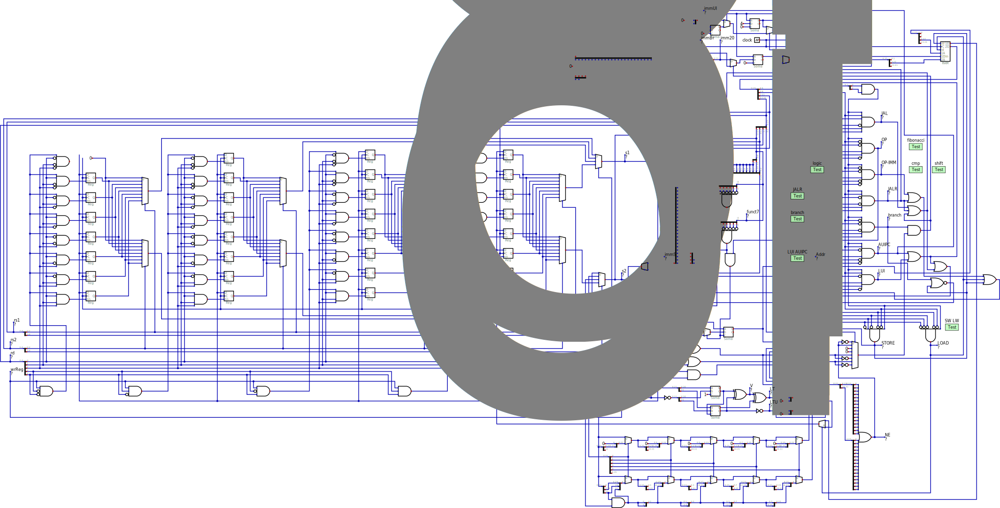

O sinal STORE pode diretamente controlar o sinal *str* da memória enquanto o LOAD pode ser ligado ao *ld*
da memória. A entrada de dados da memória pode vir da saída *s2* dos registradores e o endereço pode
vir do somador da ALU pois vamos usar o funct3 para definir a variante do LOAD e STORE de modo que a saída
da ALU pode não ser o que queremos.

O NOT que impedia a escrita no banco dos registradores para a instruções de desvio condicional foi
trocado por um NOR para que o STORE também não escreva nos registradores, como indicado na tabela acima.

O LOAD, por sua vez, escreve no banco de registradores mas não o resultado da ALU nem PC+4. Precisamos
de um novo multiplexador para receber o dado vindo da memória. Mas a tabela mostra que enquanto o load
usa o mesmo imm12 do OP-IMM e JALR, o STORE tem um imediato quase idêntico ao dos desvios condicionais.
Resolvemos isso com mais um multiplexador.

Agora podemos escrever e ler da memória, mas apenas palavras inteiras. Mas talvez seja mais conveniente
trabalhar com informações de 16 bits ou até acessar o bytes (8 bits) individuais. O campo funct3 indica
o tamanho a ser transferido. Na leitura da memória é só ter um novo circuito que usa o dois bits de baixo
do endereço e a informação da largura para extrair os bits relevantes transformando num número de 32 bits
a ser enviado para o registrador.

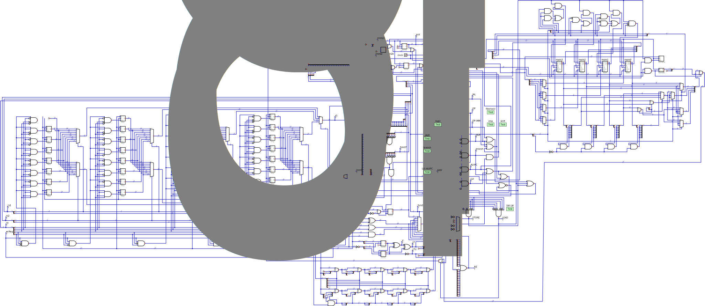

A escrita de parte de uma palarva é mais complicada. Uma opção é ler a palavra inteira, modificar os bits
desejados e escrever a palavra inteira de volta. Ao invés disso usaremos 4 circuitos de memória individuais
de 8 bits cada uma. Agora temos 4 sinais *str* separadas que podemos controlar individualmente.

| funct3_1 | funct3_0 | A_1 | A_0 | str_3 | str_2 | str_1 | str_0 |
|----------|----------|-----|-----|-------|-------|-------|-------|
| 0        |   0      | 0   | 0   | 0     | 0     | 0     | 1     |
| 0        |   0      | 0   | 1   | 0     | 0     | 1     | 0     |
| 0        |   0      | 1   | 0   | 0     | 1     | 0     | 0     |
| 0        |   0      | 1   | 1   | 1     | 0     | 0     | 0     |
| 0        |   1      | 0   | 0   | 0     | 0     | 1     | 1     |
| 0        |   1      | 1   | 0   | 1     | 1     | 0     | 0     |
| 0        |   1      | X   | 1   | X     | X     | X     | X     |
| 1        |   0      | 0   | 0   | 1     | 1     | 1     | 1     |
| 1        |   0      | X   | 1   | X     | X     | X     | X     |
| 1        |   0      | 1   | X   | X     | X     | X     | X     |
| 1        |   1      | X   | X   | X     | X     | X     | X     |

Estes sinais são todos 0 se não for uma instrução STORE. Além dos sinais *str* é necessário reorganizar os
dados. Se estivermos gravando um byte, for exemplo, então os bits 7 a 0 precisar ir para todas as 4
memórias. Isso é feito com 4 multiplexadores de 4 entradas de 32 bits cada uma e controlados pelos dois
bits de baixo de funct3.

Tudo isso é supondo que apenas acessos alinhados são permitidos. Bytes podem ser lidos ou escritos em
qualquer endereço enquanto palavras de 16 bits apenas em endereços pares e palavras de 32 bits apenas
em endereços múltiplos de 4.

Para a leitura também usamos multiplexadores:

| funct3_1 | funct3_0 | A_1 | A_0 | byte3 | byte2 | byte1 | byte0 |
|----------|----------|-----|-----|-------|-------|-------|-------|
| 0        |   0      | 0   | 0   | sign0 | sign0 | sign0 | mem0  |
| 0        |   0      | 0   | 1   | sign1 | sign1 | sign1 | mem1  |
| 0        |   0      | 1   | 0   | sign2 | sign2 | sign2 | mem2  |
| 0        |   0      | 1   | 1   | sign3 | sign3 | sign3 | mem3  |
| 0        |   1      | 0   | 0   | sign1 | sign1 | mem1  | mem0  |
| 0        |   1      | 1   | 0   | sign3 | sign3 | mem3  | mem2  |
| 0        |   1      | X   | 1   | X     | X     | X     | X     |
| 1        |   0      | 0   | 0   | mem3  | mem2  | mem1  | mem0  |
| 1        |   0      | X   | 1   | X     | X     | X     | X     |
| 1        |   0      | 1   | X   | X     | X     | X     | X     |
| 1        |   1      | X   | X   | X     | X     | X     | X     |

O bit mais significativo do endereço é usado para selecionar os periféricos (teclado e terminal). Reservar
2GB completos para isso é um disperdício mas o foco neste projetos é simplicidade e não eficiência.

---

- [4. FPGAs e Shin JAMMA](4.fpga.md)
- [5. Vídeo e Áudio](5.av.md)
- [6. Pegasus 42](6.pegasus42.md)
- [A. História](A.hist.md)
