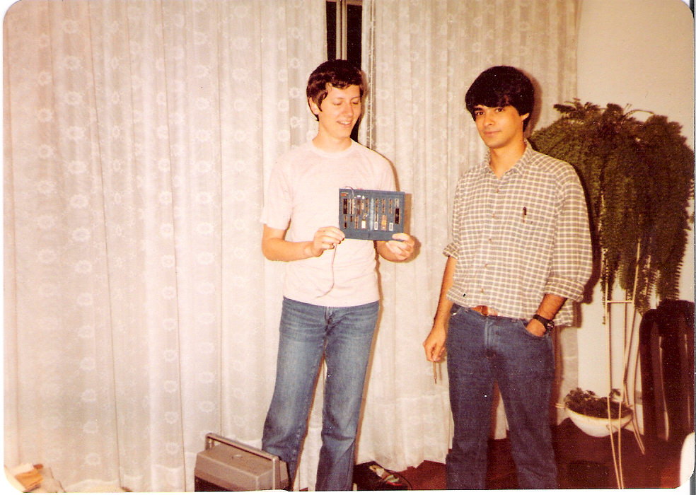
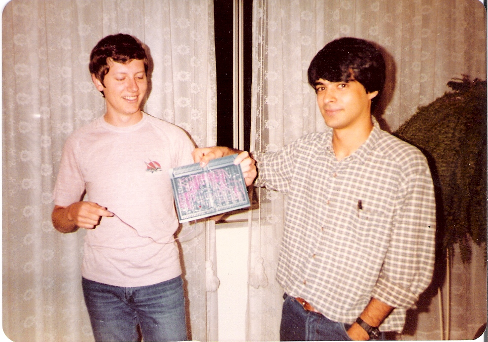
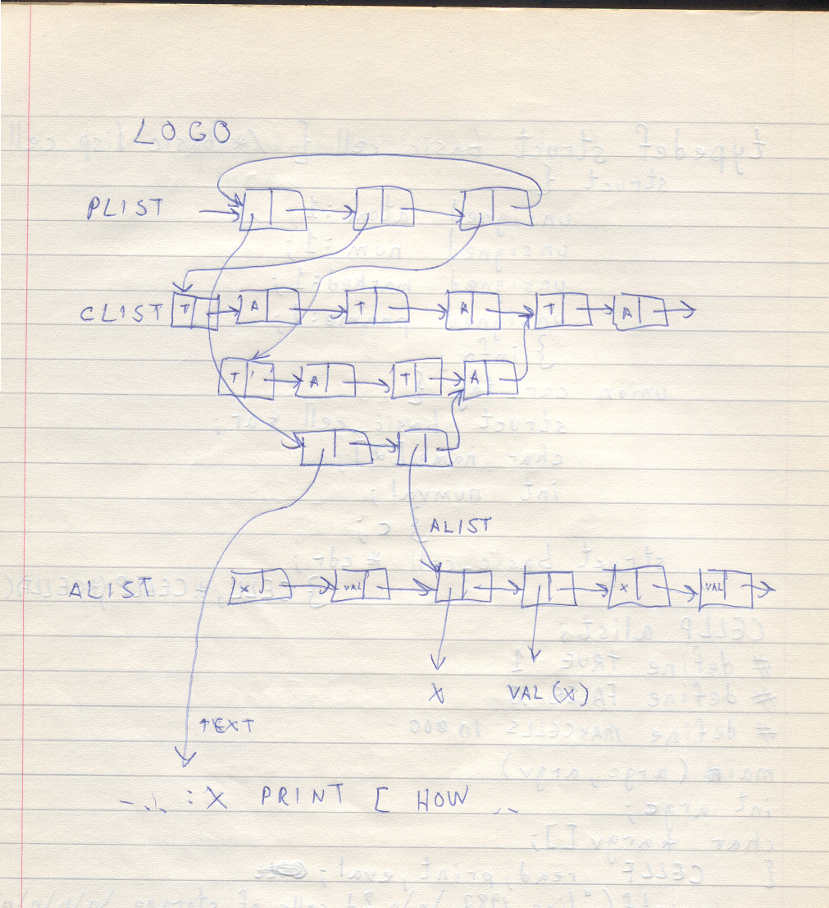
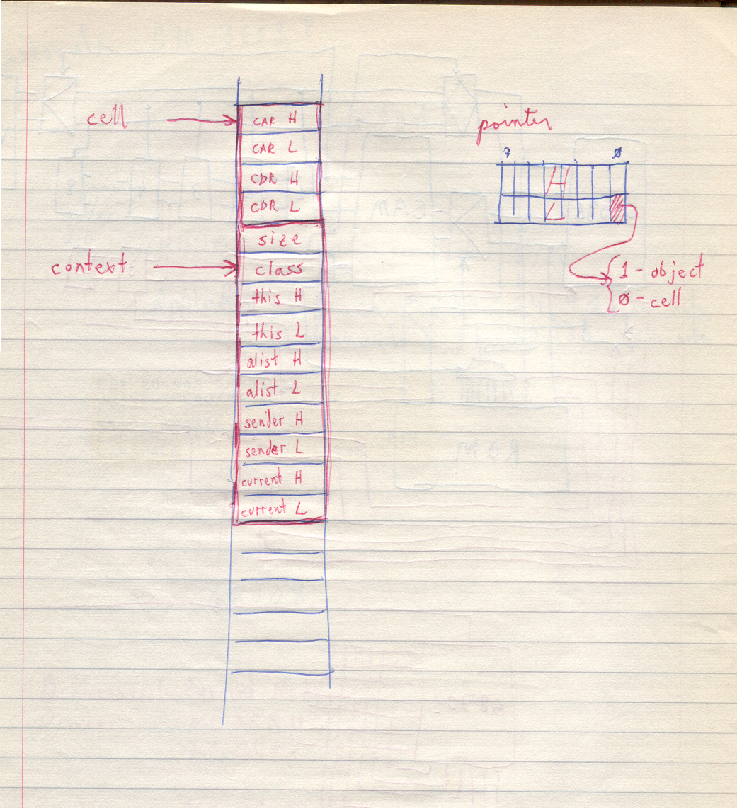
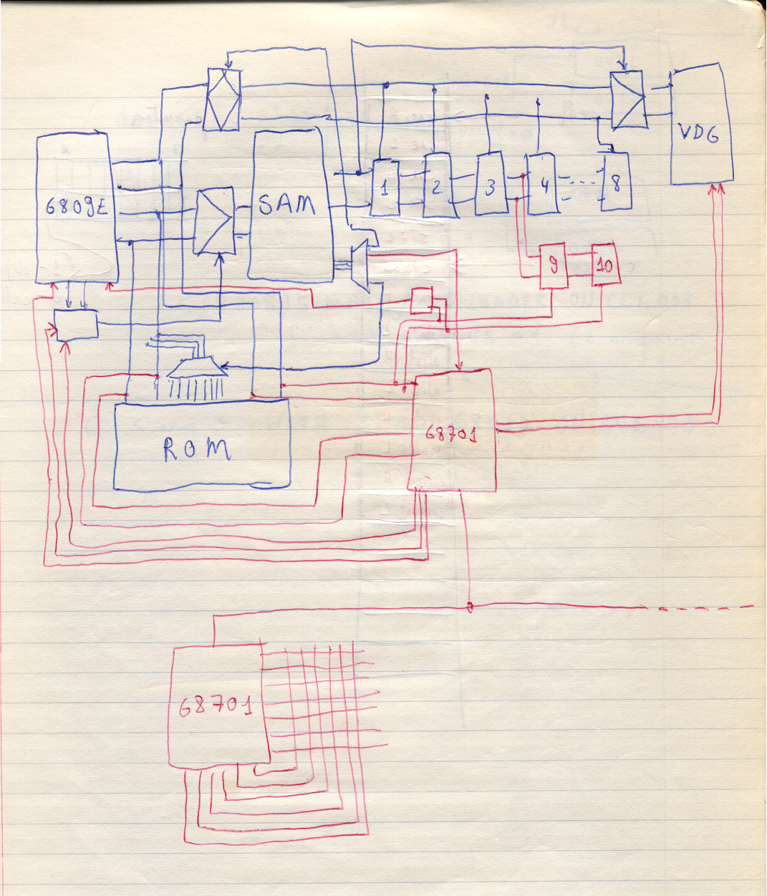
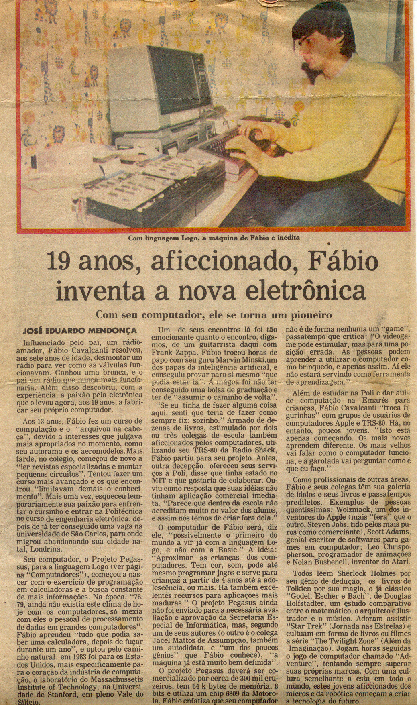
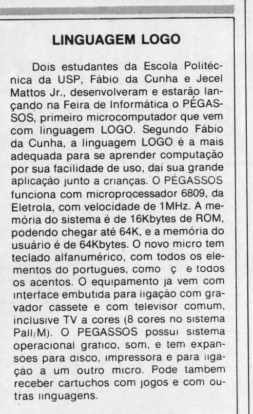
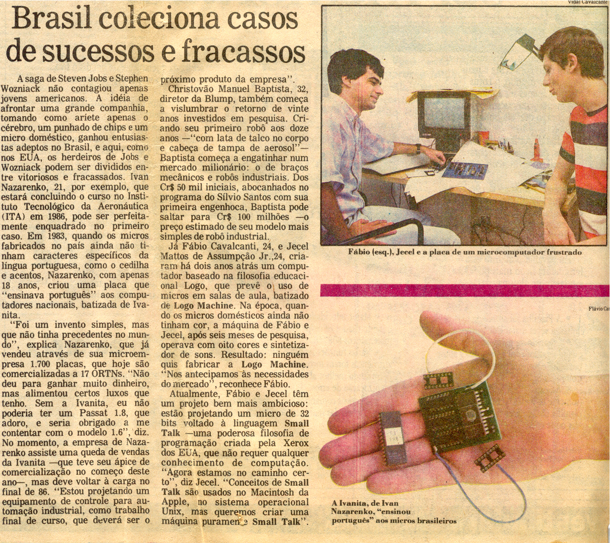

- [1. Chaves, Portas Lógicas, Circuitos Combinacionais](1.comb.md)
- [2. Circuitos Sequenciais](2.seq.md)
- [3. Processadores](3.cpu.md)
- [4. FPGAs e Shin JAMMA](4.fpga.md)
- [5. Vídeo e Áudio](5.av.md)
- [6. Pegasus 42](6.pegasus42.md)

---
# A. História

De 1977 a 1991 o Brasil teve uma "reserva de mercado" para computadores de pequeno porte. Na época praticamente
toda importação era proibida, de automóveis a chocolate incluindo computadores. Mas para os outros produtos
uma empresa estrangeira como a Volkswagen ou a Nestlé poderia abrir fábricas no país para vender localmente.
A reserva impedia isso para o caso de mini e microcomputadores.

Numa época de alta inflação e sem crescimento econômico, o setor de informática era um dos poucos em franca
expansão. Isso atraiu investimento de áreas não relacionadas, especialmente pela oportunidade de poder copiar
produtos estrangeiros sem ter que enfrentar a concorrência dos originais. Neste context um grupo do setor
bancário procurou o advogado Amaro Moraes e Silva Neto em busca de idéias e o Amaro disse que uma coisa que
ninguém estava fazendo era um computador para crianças. Ele disse que conhecia um gênio da computação que
poderia desenvolver tal produto.

Ele estava pensando em Fábio Cavalcante da Cunha, que era oficialmente estudante de engenharia eletrônica da
Escola Politécnica da Universidade de São Paulo (Poli-USP) mas estava na época mais focado no seu emprego numa loja
de computadores.

